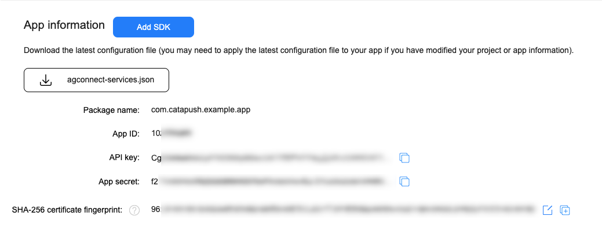
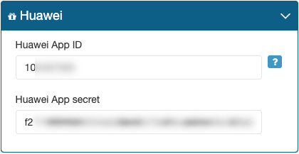

# Catapush Android SDK Documentation

## Index

*   [Catapush 10.2.x](#catapush10.2.x)
*   [Project prerequisites](#project-pre-requisites)
*   [Core module](#core-module)
    *   [Include the Core module as a dependency](#include-the-core-module-as-a-dependency)
    *   [Update your app AndroidManifest.xml](#update-your-app-androidmanifest.xml)
    *   [Error handling](#error-handling)
    *   [Initialization](#initialization)
    *   [RxJava catch-all error handler](#rxjavacatchall)
    *   [Start](#start)
*   [Google Mobile Services (GMS) module](#gms-module)
    *   [Firebase Cloud Messaging prerequisites](#firebase-cloud-messaging-prerequisites)
    *   [Include the GMS module as a dependency](#include-the-gms-module-as-a-dependency)
    *   [Google Mobile Services Gradle plugin configuration](#google-mobile-services-gradle-plugin-configuration)
    *   [Update your Catapush initialization to use the GMS module](#update-your-catapush-initialization-to-use-the-gms-module)
*   [Huawei Mobile Services (HMS) module](#huawei-mobile-services-hms-module)
    *   [Huawei Push Kit prerequisites](#Huawei-Push-Kit-prerequisites)
    *   [Include the HMS module as a dependency](#include-the-hms-module-as-a-dependency)
    *   [Huawei Mobile Services Gradle plugin configuration](#huawei-mobile-services-gradle-plugin-configuration)
    *   [Update your Catapush initialization to use the HMS module](#update-your-catapush-initialization-to-use-the-hms-module)
*   [Advanced](#advanced)
    *   [Notification management](#notification-management)
    *   [Disable Push Notification Visualization](#disable-push-notification-visualization)
    *   [Pause Push Notification Visualization](#pause-push-notification-visualization)
    *   [Hide Notifications when User is in your Messages List](#hide-notifications-when-user-is-in-your-messages-list)
    *   [Notification Visualization](#notification-visualization)
    *   [Sending Read Notification Receipt Manually](#sending-read-notification-receipt-manually)
    *   [Catapush conversation channels feature](#catapush-conversation-channels-feature)
    *   [Load and display messages attachment](#load-and-display-messages-attachment)
    *   [Enabling optimal QoS for Silent Push notifications by ignoring Doze](#ignoring-battery-optimizations)
*   [Advanced UI](#advanced-ui)
*   [FAQ](#FAQ)
    *   [Which is the minimum supported Android API?](#which-minimum-API)
    *   [What's the size of the library?](#what-size-library)
    *   [What are battery and bandwidth usages?](#what-battery-usage)
    *   [There is an example project available?](#there-is-example)

## [Catapush 10.2.x](#catapush10.2.x)

Catapush SDK for Android 10.2.x introduces a modularization that separates the Catapush features in different artifacts.  
This approach gives you the ability to only include the needed modules, thus reducing the size of your dependencies and optimizing build times.  
The available modules are:  

*   `core` the main Catapush SDK implementation
*   `gms` the integration of Catapush SDK with Google Mobile Services / Firebase Cloud Messaging
*   `hms` the integration of Catapush SDK with Huawei Mobile Services / Push Kit (starting from version 10.2.10)
*   `ui` the Catapush UI Components

## [Project prerequisites](#project-pre-requisites)

Catapush Android SDK assumes that your project:  

1.  Targets Android 10.0 (API level 29)
2.  It's been migrated from Android Support Library to Android Jetpack (AndroidX) If not, please refer to the [official guide](https://developer.android.com/jetpack/androidx/migrate).

### [Core module](#core-module)

Catapush core is the main module of our SDK, it allows your app to send and receive messages while it’s in foreground.

To enable messages background delivery (i.e. when the device is in stand-by) you’ll need a push notification service plugin.  
See the Catapush GMS module or the Catapush HMS module or both.

#### [Include the Core module as a dependency](#include-the-core-module-as-a-dependency)

At the top of _app/build.gradle_, before the _android_ block, add the Jitpack repository to the _repositories_ section:

```groovy
repositories {
    maven { url "https://jitpack.io" }
}
```

Then, in the dependencies block, add a new implementation:

```groovy
implementation('com.catapush.catapush-android-sdk:core:10.2.10')
```

#### [Update your app AndroidManifest.xml](#update-your-app-androidmanifest.xml)

Set your Catapush app key declaring this meta-data inside the application node of your AndroidManifest.xml
```xml
<meta-data
    android:name="com.catapush.library.APP_KEY"
    android:value="YOUR_APP_KEY" />
```
_YOUR_APP_KEY_ is the _AppKey_ of your Catapush App (go to your [Catapush App configuration dashboard](https://www.catapush.com/panel/dashboard), select your App by clicking "View Panel" and then click on App details section)

Then you need to declare a custom Catapush broadcast receiver and a permission to secure its broadcasts.

Add this permission definition in your `AndroidManifest.xml`:
```xml
<permission
    android:name="${applicationId}.permission.CATAPUSH_MESSAGE"
    android:protectionLevel="signature" />
```

Then, in the `<application>` block add this receiver:
```xml
<receiver
    android:name=".MyReceiver"
    android:permission="${applicationId}.permission.CATAPUSH_MESSAGE">
    <intent-filter>
        <action android:name="com.catapush.library.action.MESSAGE_RECEIVED" />
        <action android:name="com.catapush.library.action.MESSAGE_OPENED" />
        <action android:name="com.catapush.library.action.MESSAGE_SENT" />
        <action android:name="com.catapush.library.action.MESSAGE_SENT_CONFIRMED" />
        <action android:name="com.catapush.library.action.NOTIFICATION_CLICKED" />
        <action android:name="com.catapush.library.action.RELOGIN_NOTIFICATION_CLICKED" />
        <action android:name="com.catapush.library.action.INVALID_LIBRARY" />
        <action android:name="com.catapush.library.action.CONNECTING" />
        <action android:name="com.catapush.library.action.CONNECTED" />
        <action android:name="com.catapush.library.action.DISCONNECTED" />
        <action android:name="com.catapush.library.action.NETWORK_ERROR" />
        <action android:name="com.catapush.library.action.PUSH_SERVICE_ERROR" />
        <category android:name="${applicationId}" />
    </intent-filter>
</receiver>
```

#### [Create the custom Catapush broadcasts receiver](#create-the-custom-catapush-broadcasts-receiver)

To communicate with Catapush, you can extend `CatapushReceiver` or `CatapushTwoWayReceiver` and implement the needed methods. You can copy/paste the following class:
```java
import android.content.Context;
import android.util.Log;

import androidx.annotation.NonNull;

import com.catapush.library.CatapushTwoWayReceiver;
import com.catapush.library.exceptions.CatapushAuthenticationError;
import com.catapush.library.exceptions.PushServicesException;
import com.catapush.library.messages.CatapushMessage;

public class MyReceiver extends CatapushTwoWayReceiver {

    @Override
    public void onConnected(@NonNull Context context) {
        Log.d("MyApp", "Connected");
    }

    @Override
    public void onMessageReceived(@NonNull CatapushMessage msg, @NonNull Context context) {
        Log.d("MyApp", "Received Message: " + msg.toString());
    }

    @Override
    public void onMessageOpened(@NonNull CatapushMessage msg, @NonNull Context context) {
        Log.d("MyApp", "Opened Message: " + msg.toString());
    }

    @Override
    public void onNotificationClicked(@NonNull CatapushMessage message, @NonNull Context context) {
        Log.d("MyApp", "Notification clicked: " + message.toString());
    }

    @Override
    public void onRegistrationFailed(@NonNull CatapushAuthenticationError error, @NonNull Context context) {
        Log.e("MyApp", "Error Message: " + error.getMessage());
    }

    @Override
    public void onDisconnected(int errorCode, @NonNull Context context) {
        Log.d("MyApp", "Disconnected: " + errorCode);
    }

    @Override
    public void onConnecting(@NonNull Context context) {
        Log.d("MyApp", "Connecting...");
    }

    @Override
    public void onPushServicesError(@NonNull PushServicesException error, @NonNull Context context) {
    }

    @Override
    public void onMessageSent(@NonNull CatapushMessage message, @NonNull Context context) {
        Log.d("MyApp", "Message marked as sent: " + message.toString());
    }

    @Override
    public void onMessageSentConfirmed(@NonNull CatapushMessage message, @NonNull Context context) {
        Log.d("MyApp", "Message sent and delivered: " + message.toString());
    }

}
```

#### [Error handling](#error-handling)

Through your CatapushReceiver callbacks you may receive the following error codes:

The `onDisconnect(int errorCode, Context context)` callback might be executed with the following error codes:

<table class="table">

<tbody>

<tr>

<th>errorCode</th>

<th>Description</th>

<th>Suggested Strategy</th>

</tr>

<tr>

<td>3 = BACKEND_NOT_AVAILABLE</td>

<td>The SDK couldn’t establish a connection to the Catapush remote messaging service. It might be blocked by a firewall or the remote messaging service might be temporarily disrupted.</td>

<td>Please check your internet connection and try to reconnect again in a few minutes.</td>

</tr>

<tr>

<td>4 = INTERNET_NOT_AVAILABLE</td>

<td>The device is not connected to the internet</td>

<td>Inform the user of the lack of connectivity and try again.</td>

</tr>

<tr>

<td>6 = SERVICE_STOPPED</td>

<td>- The Android system stopped the messaging service due to power saving policies - The local messaging service stopped following a network error</td>

<td>This is the expected behavior on Android 8.0 and later. You should expect this code to be delivered around a minute after your app went to background.</td>

</tr>

<tr>

<td>7 = SERVICE_STOPPED_AS_REQUESTED</td>

<td>The local messaging service stopped after explicitly invoking Catapush.stop()</td>

<td></td>

</tr>

</tbody>

</table>

The `onRegistrationFailed(CatapushAuthenticationError error, Context context)` callback might be executed with the following reason codes:

<table class="table">

<thead>

<tr>

<th>reasonCode</th>

<th>Description</th>

<th>Suggested Strategy</th>

</tr>

</thead>

<tbody>

<tr>

<td>11 = XMPP_MULTIPLE_LOGIN</td>

<td>The same user identifier has been logged on another device, the messaging service will be stopped on this device</td>

<td>Please check that you are using a unique identifier for each device, even on devices owned by the same user. If you received this error you it means that you are using the same username/password on different devices. You should delete the stored credentials and clear the Catapush instance so it won’t try to reconnect with this identifier. Provide a new identifier to this installation to solve the issue.</td>

</tr>

<tr>

<td>14011 = API_UNAUTHORIZED</td>

<td>The credentials been rejected</td>

<td>Please verify your identifier and password validity. The user might have been deleted fromthe Catapush app (via API or from the dashboard) or the password has changed. You should not keep retrying, delete the stored credentials, clear the Catapush instance. Provide a new identifier to this installation to solve the issue.</td>

</tr>

<tr>

<td>15001 = API_INTERNAL_ERROR</td>

<td>Internal error of the remote messaging service</td>

<td>An unexpected internal error on the remote messaging service has occurred. This is probably due to a temporary service disruption. Please try again in a few minutes.</td>

</tr>

<tr>

<td>24042 = REGISTRATION_NOT_FOUND_USER</td>

<td>Register API: user not found</td>

<td>The user has been probably deleted from the Catapush app (via API or from the dashboard). You should not keep retrying, delete the stored credentials, clear the Catapush instance. Provide a new identifier to this installation to solve the issue.</td>

</tr>

<tr>

<td>44043 = UPDATE_PUSH_TOKEN_NOT_FOUND_USER</td>

<td>Update push token API: user not found</td>

<td>The user has been probably deleted from the Catapush app (via API or from the dashboard). You should not keep retrying, delete the stored credentials, clear the Catapush instance. Provide a new identifier to this installation to solve the issue.</td>

</tr>

</tbody>

</table>

#### [Initialization](#initialization)

You must initialize Catapush in your class that extends `Application`.

You also have to provide your customized notification style template here.

Your `Application.onCreate()` method should contain the following lines:

```java
public class MyApplication extends MultiDexApplication {

    private static final String NOTIFICATION_CHANNEL_ID = "your.app.package.CHANNEL_ID";

    @Override
    public void onCreate() {
        super.onCreate();

        setupRxErrorHandler(); // Required: see section 'RxJava catch-all error handler' for the implementation

        // This is the Android system notification channel that will be used by the Catapush SDK
        // to notify the incoming messages since Android 8.0. It is important that the channel
        // is created before starting Catapush.
        // See https://developer.android.com/training/notify-user/channels
        NotificationManager nm = ((NotificationManager) getSystemService(Context.NOTIFICATION_SERVICE));
        if (nm != null && Build.VERSION.SDK_INT >= Build.VERSION_CODES.O) {
        String channelName = getString(R.string.catapush_notification_channel_name);
        NotificationChannel channel = nm.getNotificationChannel(NOTIFICATION_CHANNEL_ID);
        if (channel == null) {
            channel = new NotificationChannel(
                    NOTIFICATION_CHANNEL_ID,
                    channelName,
                    NotificationManager.IMPORTANCE_HIGH);
            // Customize your notification appearance here (Android >= 8.0)
            // it's possible to customize a channel only on creation
            channel.enableVibration(true);
            channel.setVibrationPattern(new long[]{100, 200, 100, 300});
            channel.enableLights(true);
            channel.setLightColor(ContextCompat.getColor(this, R.color.primary));
        } else if (!channelName.contentEquals(channel.getName())) {
            // Update channel name, useful when the user changes the system language
            channel.setName(channelName);
        }
        nm.createNotificationChannel(channel);
        }

        Catapush.getInstance().init(
            this,
            NOTIFICATION_CHANNEL_ID,
            Collections.emptyList(), // Push notification services modules will be configured here, leave empty for now
            new Callback() {
                @Override
                public void success(Boolean response) {
                    Log.d("MyApp", "Catapush has been successfully initialized");

                    // This is the notification template that the Catapush SDK uses to build
                    // the status bar notification shown to the user.
                    // Some settings like vibration, lights, etc. are duplicated here because
                    // before Android introduced notification channels (Android < 8.0) the
                    // styling was made on a per-notification basis.
                    final NotificationTemplate template = NotificationTemplate.builder()
                            .swipeToDismissEnabled(false)
                            .title("Your notification title!")
                            .iconId(R.drawable.ic_stat_notify_default)
                            .vibrationEnabled(true)
                            .vibrationPattern(new long[]{100, 200, 100, 300})
                            .soundEnabled(true)
                            .soundResourceUri(RingtoneManager.getDefaultUri(RingtoneManager.TYPE_ALARM))
                            .circleColor(ContextCompat.getColor(SampleApplication.this, R.color.primary))
                            .ledEnabled(true)
                            .ledColor(Color.BLUE)
                            .ledOnMS(2000)
                            .ledOffMS(1000)
                            .build();

                    Catapush.getInstance().setNotificationTemplate(template);
                }

                @Override
                public void failure(@NonNull Throwable t) {
                    Log.d("MyApp", "Catapush initialization error: " + t.getMessage());
                }
            }
        );
    }
}
```

If you are defining a custom application class for your app for the first time, remember to add it to your `AndroidManifest.xml`:

```xml
<application
    android:name=".MyApplication"
    android:icon="@mipmap/ic_launcher"
    android:label="@string/app_name"
    android:theme="@style/AppTheme">
```

Please note that, to be used, the `MultiDexApplication` requires your app to depend on the `androidx.multidex:multidex` dependency.

#### [RxJava catch-all error handler](#rxjavacatchall)

Catapush depends internally on RxJava. Since RxJava2 it's required for the app that includes the SDK to define a global error handler that prevents your app from crashing if any unhandleable error occurs in the library.

```java
private void setupRxErrorHandler() {
    RxJavaPlugins.setErrorHandler(e -> {
        if (e instanceof UndeliverableException) {
            // The exception was wrapped
            e = e.getCause();
        }
        if (e instanceof IOException) {
            // Fine, irrelevant network problem or API that throws on cancellation
            return;
        }
        if (e instanceof InterruptedException) {
            // Fine, some blocking code was interrupted by a dispose call
            return;
        }
        if ((e instanceof NullPointerException) || (e instanceof IllegalArgumentException)) {
            // That's likely a bug in the application
            Thread.currentThread().getUncaughtExceptionHandler()
                    .uncaughtException(Thread.currentThread(), e);
            return;
        }
        if (e instanceof IllegalStateException) {
            // That's a bug in RxJava or in a custom operator
            Thread.currentThread().getUncaughtExceptionHandler()
                    .uncaughtException(Thread.currentThread(), e);
            return;
        }
        // Log this to your analytics platform
        Log.e(MyApplication.class.getCanonicalName(), e.getMessage());
    });
}
```

See RxJava official docs [What's different in 2.0 - error handling](https://github.com/ReactiveX/RxJava/wiki/What's-different-in-2.0#error-handling) for more information.

#### [Start](#start)

Catapush setup is complete.  
Whenever you want to start using Catapush, you just need to call the `start` method. For instance, in your main `Activity`, after your user has logged in, you can use the following code to start Catapush:

```java
Catapush.getInstance()
.setUser(CATAPUSH_USER, CATAPUSH_PASSWORD)
.start(new RecoverableErrorCallback() {
    @Override
    public void success(Boolean aBoolean) {
        Log.d("MyApp", "Catapush has been successfully started");
    }
    @Override
    public void warning(@NonNull Throwable throwable) {
        Log.d("MyApp", "Catapush warning: " + throwable.getMessage());
    }
    @Override
    public void failure(@NonNull Throwable throwable) {
        Log.d("MyApp", "Catapush can't be started: " + throwable.getMessage());
    }
});
```

*   `CATAPUSH_USER` is the user Identifier present in Users section of the Catapush App dashboard
*   `CATAPUSH_PASSWORD` is the user Password present in Users section of the Catapush App dashboard

The start callback provides you 3 methods: `success` and `failure` are self-explaining.  
The `warning` method is used to notify you when the Catapush SDK identifies potential problems in the user device settings that might hinder your delivery reliability in some scenarios.  
You can ignore those warning but we suggest you to guide your users through the necessary reconfiguration steps.

### [Google Mobile Services (GMS) module](#gms-module)

Catapush gms module is the integration of the SDK with Google Mobile Services / Firebase Cloud Messaging, it allows your app to send and receive messages while it’s in background on devices with Google Play Services installed.

#### [Firebase Cloud Messaging prerequisites](#Firebase-Cloud-Messaging-prerequisites)

The Catapush GMS module needs Firebase to work.  

1. Create a new Project in Firebase Console and obtain your Server Key and your Sender ID
2. Save your google-services.json file in your app/ folder
3. Go to your Catapush App configuration dashboard and select your app by clicking "View Panel"
4. In Platforms section add your service-account.json to your Android configuration

#### [Include the GMS module as a dependency](#include-the-gms-module-as-a-dependency)

In your `app/build.gradle`, in the dependencies block, add a new implementation:

```groovy
implementation('com.catapush.catapush-android-sdk:gms:10.2.10')
```

#### [Google Mobile Services Gradle plugin configuration](#google-mobile-services-gradle-plugin-configuration)

The Google Mobile Services plugin for Gradle parses the configuration information from the google-services.json file and sets up its client libraries for you.

Add the plugin to your project by updating your project `build.gradle` file as follows:
```groovy
buildscript {
    repositories {
        google()
        jcenter()
    }
    dependencies {
        classpath 'com.android.tools.build:gradle:4.0.2'
        classpath 'com.google.gms:google-services:4.3.4' 
    }
}
```
And, at the bottom of `app/build.gradle`, add the following line:

```groovy
apply plugin: 'com.google.gms.google-services'
```

Finally, add this metadata tag to this `<application>` block in your `AndroidManifest.xml`:

```xml
<meta-data
    android:name="com.google.android.gms.version"
    android:value="@integer/google_play_services_version" />
```

#### [Update your Catapush initialization to use the GMS module](#update-your-catapush-initialization-to-use-the-gms-module)

In your Application.onCreate() method add the CatapushGMS.INSTANCE to the SDK init:

```java
Catapush.getInstance().init(
    this,
    NOTIFICATION_CHANNEL_ID,
    Collections.singletonList(CatapushGms.INSTANCE), // GMS module is enabled here
    …
);
```

### [Huawei Mobile Services (HMS) module](#huawei-mobile-services-hms-module)
Catapush hms module is the integration of the SDK with Huawei Mobile Services / Push Kit, it allows your app to send and receive messages while it’s in background on Huawei devices.

#### [Huawei Push Kit prerequisites](#Huawei-Push-Kit-prerequisites)
The Catapush HMS module needs Huawei Push Kit to work.
1. Create a new project in Huawei AppGallery Connect
2. Navigate to "Project settings" from the menu on the left and select the "Manage APIs" tab.
3. Scroll down the list, find "Push Kit" and enable it
4. Select the "General information" tab and scroll down to take note of the `App ID` and `App secret` values<br/>
3. Download the `agconnect-services.json` file and save it in your `app/` folder
4. Open the Catapush App configuration dashboard, select your app name from the menu and then select "Platforms" section
5. Paste the `App ID` and `App secret` values in the corresponding fields<br/>  

#### [Include the HMS module as a dependency](#include-the-hms-module-as-a-dependency)
In your `app/build.gradle`, in the dependencies block, add a new implementation:

```groovy
implementation('com.catapush.catapush-android-sdk:hms:10.2.10')
```

#### [Huawei Mobile Services Gradle plugin configuration](#huawei-mobile-services-gradle-plugin-configuration)
The Huawei Mobile Services plugin for Gradle parses the configuration information from the `agconnect-services.json` file and sets up its client libraries for you.
Add the plugin to your project by updating your project build.gradle file as follows:

```groovy
buildscript {
    repositories {
        google()
        jcenter()
        maven { url 'https://developer.huawei.com/repo/' }
    }
    dependencies {
        classpath 'com.android.tools.build:gradle:4.0.2'
        classpath 'com.huawei.agconnect:agcp:1.4.0.100' 
    }
}
```

And, at the top of your `app/build.gradle` file, add the following line:

```groovy
apply plugin: 'com.huawei.agconnect'
```

#### [Update your Catapush initialization to use the HMS module](#update-your-catapush-initialization-to-use-the-hms-module)
In your `Application.onCreate()` method add the `CatapushGMS.INSTANCE` to the SDK init:

```java
Catapush.getInstance().init(
       this,
       NOTIFICATION_CHANNEL_ID,
       Collections.singletonList(CatapushHms.INSTANCE), // HMS module is enabled here
       …
);
```

If you want to use both GMS and HMS module just pass both to the Catapush initialization:

```java
Catapush.getInstance().init(
       this,
       NOTIFICATION_CHANNEL_ID,
       Arrays.asList(CatapushGms.INSTANCE, CatapushHms.INSTANCE), // GMS and HMS module are enabled here
       …
);
```

Please note that the order of the modules in the list will be taken into account when electing the push service to be used on a device: if both services are available and working then the Catapush SDK will pick the first in the list.


## [Advanced](#advanced)

### [Notification management](#notification-management)

By default Push Notifications visualization is managed by the Catapush library, which builds Notifications and displays them in the notification bar with your UI settings.

### [Disable Push Notification Visualization](#disable-push-notification-visualization)

You can choose to disable Push Notifications visualization permanently using:

```java
Catapush.getInstance().disableNotifications();
```

And re-enable them using:
```java
Catapush.getInstance().enableNotifications();
```

This state will be persisted and preserved across app restarts and Catapush starts/stops.

**Note**: disabling Push Notifications **does not** stop receiving messages, but you have to handle Open Notification feedback by your own.

### [Pause Push Notification Visualization](#pause-push-notification-visualization)

You can choose to disable Push Notifications visualization temporarily using:
```java
Catapush.getInstance().pauseNotifications();
```

And re-enable them using:

```java
Catapush.getInstance().resumeNotifications();
```

This state will not be persisted. If you restart your app or stop/start Catapush the push notifications visualization will be resumed.

**Note**: pausing Push Notifications **does not** stop receiving messages, but you have to handle Open Notification feedback by your own.

### [Hide Notifications when User is in your Messages List](#hide-notifications-when-user-is-in-your-messages-list)

It is also useful to pause/resume Push Notifications visualization when your Message list is active and visible.

You can disable and enable them as in the following example, taking advantage of your `Activity` lifecycle methods:
```java
@Override
public void onResume() {
    super.onResume();
    // Our app is open and we don't want status bar notification in this scenario
    Catapush.getInstance().pauseNotifications();
}
```

Enable Push visualization when the user close your Message Thread list, e.g. ListActivity:
```java
@Override
public void onPause() {
    super.onPause();
    // Our app is not visible and we want status bar notification in this scenario
    Catapush.getInstance().resumeNotifications();
}
```

### [Notification Visualization](#notification-visualization)

When you decide to use Android system Notification provided by Catapush, you can detect the click on the notification with your `MyReceiver` class. In the following example, when the user clicks the notification, an `onNotificationClicked` event is triggered and the appropriate `CatapushMessage` is passed as argument. The example shows how to start an `Activity` on this click event:
```java
@Override
public void onNotificationClicked(CatapushMessage catapushMessage, Context context) {
    Log.d("MyApp", "Opened Message: " + catapushMessage);

    Intent intent = new Intent(context, MainActivity.class);
    intent.setFlags(Intent.FLAG_ACTIVITY_NEW_TASK | Intent.FLAG_ACTIVITY_SINGLE_TOP);
    context.startActivity(intent);
}
```

### [Sending Read Notification Receipt Manually](#sending-read-notification-receipt-manually)

If you decide to disable default Push Notification management, you have to manually report every message opening:

```java
Catapush.getInstance().notifyMessageOpened(catapushMessage.id());
```

### [Catapush conversation channels feature](#catapush-conversation-channels-feature)

Since Catapush SDK for Android 10.0.0 you can deliver messages through different conversation channels. To send a message to a specific channel please see the [“channel” property of our send message API endpoint](https://www.catapush.com/docs-api?php#2.1-post---send-a-new-message) and [its description](https://www.catapush.com/docs-api?php#channels). You can list conversation channels, query messages from a specific channel or messages without channel. Please note that messages received with previous versions of the Catapush SDK and messages sent without channel are grouped in a default conversation channel identified by an empty string.

#### [List conversation channels](#list-conversation-channels)

Once Catapush is started, you can retrieve the received messages channels list using this method:

```java
Catapush.getInstance().getChannelList(…)
```

This list grows as your backend sends messages from different channels to your app.  
This list includes an empty string that represent the default channel.

#### [List messages without conversation channel](#list-messages-without-conversation-channel)

Once Catapush is started, you can retrieve the messages without channel using this method:

```java
Catapush.getInstance().getMessagesWithoutChannelAsList(…)
```

#### [List messages in a conversation channel](#list-messages-in-a-coversation-channel)

Once Catapush is started, you can retrieve the messages from a specific channel using this method:

```java
Catapush.getInstance().getMessagesFromChannelAsList(channel, …)
```

### [Load and display messages attachment](#load-and-display-messages-attachment)

If you received a message with an attachment, you’ll find its URL in the file().remoteUri() attribute.

If it’s an image, you can easily load it into an ImageView of your app i.e. with Glide:

```java
Glide.with(context).load(message.file().remoteUri()).into(imageView)
```

Please note that messages sent from the local device to the server with an attachment will provide also the local file URI, so you should prefer that instead of the remote URI:

```java
Glide.with(context).load(message.file().localUri()).into(imageView)
```

You can also open it with an external app installed on the user device with this Intent:

```java
Intent target = new Intent(Intent.ACTION_VIEW);
target.setDataAndType(imageUri, "image/*");
target.addFlags(Intent.FLAG_ACTIVITY_NEW_TASK);
target.addFlags(Intent.FLAG_GRANT_READ_URI_PERMISSION);
try {
    context.startActivity(target);
} catch (ActivityNotFoundException e) {
    // Instruct the user to install a Image reader here
    Toast.makeText(context, "Image gallery not available", Toast.LENGTH_SHORT).show();
} catch (SecurityException e) {
    Toast.makeText(context, "Can't access this image", Toast.LENGTH_SHORT).show();
}
```

If it’s a PDF you can open in an external app with this Intent:

```java
Intent target = new Intent();
target.setAction(Intent.ACTION_VIEW);
if (pdfUri.getScheme().equals("file")) {
    target.addFlags(Intent.FLAG_GRANT_READ_URI_PERMISSION);
    target.setDataAndType(pdfUri, "application/pdf");
} else {
    target.setDataAndType(pdfUri, "text/html");
}

Intent intent = Intent.createChooser(target, "Open File");
intent.addFlags(Intent.FLAG_ACTIVITY_NEW_TASK);
try {
    context.startActivity(intent);
} catch (ActivityNotFoundException e) {
    // Instruct the user to install a PDF reader here
    Toast.makeText(context, "PDF reader not available", Toast.LENGTH_SHORT).show();
} catch (SecurityException e) {
    Toast.makeText(context, "Can't access this PDF", Toast.LENGTH_SHORT).show();
}
```

### [Enabling optimal QoS for Silent Push notifications by ignoring Doze](#ignoring-battery-optimizations)

With version 6.0, Android has introduced a new feature called Doze that, under certain circumstances, might limit your app execution or network access while running in the background thus reducing reliability of sending Silent Push to execute the app; this capability is important to guarantee high priority push and the ability to start the application when it is closed / inactive.

Doze restrictions have been improved and strengthened in each subsequent Android release, ending with the introduction of App Standby Buckets in Android 9.0. These features, when your app hasn't been used for a period of time, might hinder your ability to execute Capatush SDK / your application and thus the ability of Catapush of consistently delivering messages to it.

To check if your app is being considered inactive you can use this method:  
[https://developer.android.com/reference/android/app/usage/UsageStatsManager.html#isAppInactive(java.lang.String)](https://developer.android.com/reference/android/app/usage/UsageStatsManager.html#isAppInactive(java.lang.String))  
Its javadoc gives a brief description on how the system decides which app is inactive: 
>Returns whether the specified app is currently considered inactive. This will be true if the app hasn't been used directly or indirectly for a period of time defined by the system. This could be of the order of several hours or days.

To check if your app has been classified in a low priority Standby Bucket you can use this method:  
[https://developer.android.com/reference/android/app/usage/UsageStatsManager.html#getAppStandbyBucket()](https://developer.android.com/reference/android/app/usage/UsageStatsManager.html#getAppStandbyBucket())  
From its javadoc:
>Returns the current standby bucket of the calling app. The system determines the standby state of the app based on app usage patterns. Standby buckets determine how much an app will be restricted from running background tasks such as jobs and alarms. Restrictions increase progressively from STANDBY_BUCKET_ACTIVE to STANDBY_BUCKET_RARE, with STANDBY_BUCKET_ACTIVE being the least restrictive. The battery level of the device might also affect the restrictions. Apps in buckets ≤ STANDBY_BUCKET_ACTIVE have no standby restrictions imposed. Apps in buckets > STANDBY_BUCKET_FREQUENT may have network access restricted when running in the background. The standby state of an app can change at any time either due to a user interaction or a system interaction or some algorithm determining that the app can be restricted for a period of time before the user has a need for it.

If you app is considered inactive or has been put in a Standby Bucket > STANDBY_BUCKET_FREQUENT you should ask your user to disable the battery optimizations for your app, especially if reliable delivery is critical for your business.

You can check if the user has already disabled the battery optimizations for you app using this method:  
[https://developer.android.com/reference/android/os/PowerManager.html#isIgnoringBatteryOptimizations(java.lang.String)](https://developer.android.com/reference/android/os/PowerManager.html#isIgnoringBatteryOptimizations(java.lang.String))

Then, if it's not yet ignoring the optimizations, you can open the device settings on the correct page broadcasting an Intent with the following action:  

[https://developer.android.com/reference/android/provider/Settings.html#ACTION_IGNORE_BATTERY_OPTIMIZATION_SETTINGS](https://developer.android.com/reference/android/provider/Settings.html#ACTION_IGNORE_BATTERY_OPTIMIZATION_SETTINGS)  

This list will be displayed:  

  

The user will have to find and tap your app, then choose "Don't optimize".

## [Advanced UI](#advanced-ui)

You can customize the colors and the appereace of the notifications, we have create a [dedicated guide](https://www.catapush.com/docs-android-3) for it.

## [FAQ](#FAQ)

### [Which is the minimum supported Android API?](#which-minimum-API)

The Android SDK supports [Android 4.3 (API level 18)](https://developer.android.com/studio/releases/platforms#4.3) and greater. For details about Android versions distribution, you can check [Android release notes](https://developer.android.com/studio/releases/platforms).

### [What's the size of the library?](#what-size-library)

Catapush is less than 600KB, we are building a new smaller version that will be released in 2020.

### [What are battery and bandwidth usages?](#what-battery-usage)

Catapush works hard to be a _good citizen_. In a test environment, with new messages received hourly, Catapush has proved to use less than 1% of battery and less than 100KB/day. In everyday scenarios, with low or zero message traffic, Catapush uses even less battery and the data traffic is near to 0KB/day.

### [There is an example project available?](#there-is-example)

You can download an example project on [Github](https://github.com/Catapush/catapush-android-sdk-example).