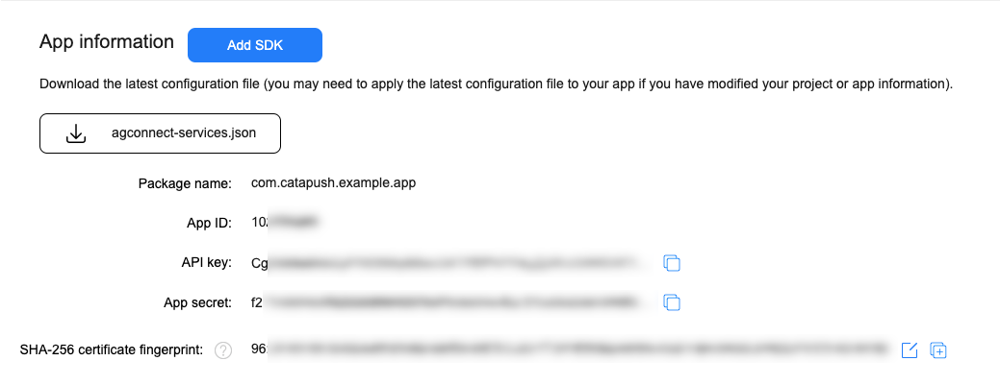
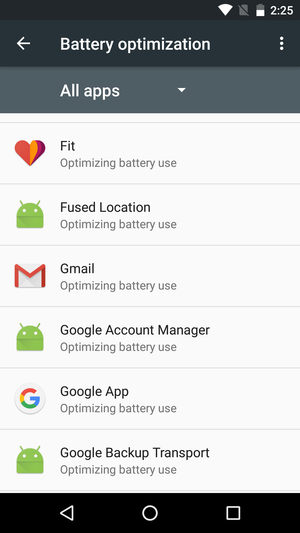

# Catapush Android SDK Documentation

## Index

*   [Catapush 14.0.x](#catapush-140x)
*   [Project prerequisites](#project-prerequisites)
*   [Core module](#core-module)
    *   [Include the Core module as a dependency](#include-the-core-module-as-a-dependency)
    *   [Update your app AndroidManifest.xml](#update-your-app-androidmanifestxml)
    *   [Error handling](#error-handling)
    *   [Initialization](#initialization)
    *   [Android notification runtime permission](#android-notification-runtime-permission)
    *   [Android notification channels support](#android-notification-channels-support)
    *   [RxJava catch-all error handler](#rxjava-catch-all-error-handler)
    *   [Start](#start)
    *   [Handle notification taps](#handle-notification-taps)
*   [Google Mobile Services (GMS) module](#google-mobile-services-gms-module)
    *   [Firebase Cloud Messaging prerequisites](#firebase-cloud-messaging-prerequisites)
    *   [Include the GMS module as a dependency](#include-the-gms-module-as-a-dependency)
    *   [Google Mobile Services Gradle plugin configuration](#google-mobile-services-gradle-plugin-configuration)
    *   [Update your Catapush initialization to use the GMS module](#update-your-catapush-initialization-to-use-the-gms-module)
    *   [OPTIONAL: integrate Catapush GMS with a pre-existent FirebaseMessagingService](#optional-integrate-catapush-gms-with-a-pre-existent-firebasemessagingservice)
*   [Huawei Mobile Services (HMS) module](#huawei-mobile-services-hms-module)
    *   [Huawei Push Kit prerequisites](#huawei-push-kit-prerequisites)
    *   [Include the HMS module as a dependency](#include-the-hms-module-as-a-dependency)
    *   [OPTIONAL: integrate Catapush HMS with a pre-existent HmsMessageService](#optional-integrate-catapush-hms-with-a-pre-existent-hmsmessageservice)
    *   [Huawei Mobile Services Gradle plugin configuration](#huawei-mobile-services-gradle-plugin-configuration)
    *   [Update your Catapush initialization to use the HMS module](#update-your-catapush-initialization-to-use-the-hms-module)
*   [Migration from Catapush 13.0.x to 14.0.x](#migration-from-catapush-130x)
*   [Migration from Catapush 12.1.x to 13.0.x](#migration-from-catapush-121x)
*   [Migration from Catapush 12.0.x to 12.1.x](#migration-from-catapush-120x)
*   [Migration from Catapush 11.2.x to 12.0.x](#migration-from-catapush-112x)
*   [Migration from Catapush 11.1.x to 11.2.x](#migration-from-catapush-111x)
*   [Migration from Catapush 10.2.x to 11.1.x](#migration-from-catapush-102x)
*   [Advanced](#advanced)
    *   [Handling client-side push services errors](#handling-client-side-push-services-errors)
    *   [Notification visualization](#notification-visualization)
    *   [Disable received messages visualization](#disable-received-messages-visualization)
    *   [Pause received messages visualization](#pause-received-messages-visualization)
    *   [Hide Notifications when User is in your Messages List](#hide-notifications-when-user-is-in-your-messages-list)
    *   [Sending Read Notification Receipt Manually](#sending-read-notification-receipt-manually)
    *   [Catapush conversation channels feature](#catapush-conversation-channels-feature)
    *   [Load and display messages attachment](#load-and-display-messages-attachment)
    *   [Enabling optimal QoS for Silent Push notifications by ignoring Doze](#enabling-optimal-qos-for-silent-push-notifications-by-ignoring-doze)
*   [Advanced UI](#advanced-ui)
*   [FAQ](#faq)
    *   [How does the library choose between GMS and HMS?](#how-does-the-library-choose-between-gms-and-hms)
    *   [Which push services provider should I prioritize?](#which-push-services-provider-should-i-prioritize)
    *   [Can I use Catapush without push notifications providers (foreground-only delivery)?](#can-i-use-catapush-without-push-notifications-providers-foreground-only-delivery)
    *   [Do I need to configure ProGuard for Catapush?](#do-i-need-to-configure-proguard-for-catapush)
    *   [What's the size of the library?](#whats-the-size-of-the-library)
    *   [What are battery and bandwidth usages?](#what-are-battery-and-bandwidth-usages)
    *   [There is an example project available?](#there-is-an-example-project-available)

## Catapush 14.0.x

Catapush 14.0.x is designed for Android 14.0 (API 34) and requires a minimum of Android 5.0 (API 21).

## Project prerequisites

Catapush Android SDK assumes that your Android project:

1. Has target SDK version set to 34 ([Android 14.0](https://developer.android.com/studio/releases/platforms#12))
2. Has minimum SDK version greater than or equal to 21 ([Android 5.0](https://developer.android.com/studio/releases/platforms#5.0))

### Core module

Catapush core is the main module of our SDK, it allows your app to send and receive messages while it’s in foreground.

To enable messages background delivery (i.e. when the device is in stand-by) you’ll need a push notification service plugin.  
See the Catapush GMS module or the Catapush HMS module sections below to install one or more push services provider.

#### Include the Core module as a dependency

At the top of the `app/build.gradle` file, before the _android_ block, add the Catapush repository to the _repositories_ section:

```groovy
repositories {
    maven { url "https://s3.eu-west-1.amazonaws.com/m2repository.catapush.com/" }
}
```

Then, in the dependencies block, add a new implementation:

```groovy
implementation 'com.catapush.catapush-android-sdk:core:14.0.0'
```

#### Update your app AndroidManifest.xml

Set your Catapush app key declaring this meta-data inside the application node of your `AndroidManifest.xml`
```xml
<meta-data
    android:name="com.catapush.library.APP_KEY"
    android:value="YOUR_APP_KEY" />
```
_YOUR_APP_KEY_ is the _AppKey_ of your Catapush App (go to your [Catapush App configuration dashboard](https://www.catapush.com/panel/dashboard), select your App by clicking "View Panel" and then click on App details section)

#### Error handling

Through your CatapushReceiver callbacks you may receive the following error codes:

The `onDisconnect(int errorCode, Context context)` callback might be executed with the following error codes:

<table class="table">

<tbody>

<tr>

<th>errorCode</th>

<th>Description</th>

<th>Suggested Strategy</th>

</tr>

<tr>

<td>3 = BACKEND_NOT_AVAILABLE</td>

<td>The SDK couldn’t establish a connection to the Catapush remote messaging service. It might be blocked by a firewall or the remote messaging service might be temporarily disrupted.</td>

<td>Please check your internet connection and try to reconnect again in a few minutes.</td>

</tr>

<tr>

<td>4 = INTERNET_NOT_AVAILABLE</td>

<td>The device is not connected to the internet</td>

<td>Inform the user of the lack of connectivity and try again.</td>

</tr>

<tr>

<td>6 = SERVICE_STOPPED</td>

<td>
 
 - The Android system stopped the messaging service due to power saving policies
 - The local messaging service stopped following a network error
 </td>

<td>This is the expected behavior on Android 8.0 and later. You should expect this code to be delivered around a minute after your app went to background.</td>

</tr>

<tr>

<td>7 = SERVICE_STOPPED_AS_REQUESTED</td>

<td>The local messaging service stopped after explicitly invoking Catapush.stop()</td>

<td></td>

</tr>

</tr>

<tr>

<td>8 = CONNECTION_PARAMETERS_LOAD_FAILED</td>

<td>The stored credentials are invalid.</td>

<td>Please check the Catapush credentials, see Catapush.setUser()</td>

</tr>

</tr>

<tr>

<td>9 = CONNECTION_TIMEOUT</td>

<td>The connection attempt timed out, might be caused by connectivity issues.</td>

<td>Please check your internet connection and try to reconnect again in a few minutes.</td>

</tr>

<tr>

<td>10 = START_TIMEOUT</td>

<td>The SDK couldn't complete the start command in a timely fashion, might be caused by connectivity issues.</td>

<td>Please check your internet connection and try to reconnect again in a few minutes.</td>

</tr>

</tbody>

</table>

The `onRegistrationFailed(CatapushAuthenticationError error, Context context)` callback might be executed with the following reason codes:

<table class="table">

<thead>

<tr>

<th>reasonCode</th>

<th>Description</th>

<th>Suggested Strategy</th>

</tr>

</thead>

<tbody>

<tr>

<td>11 = XMPP_MULTIPLE_LOGIN</td>

<td>The same user identifier has been logged on another device, the messaging service will be stopped on this device</td>

<td>Please check that you are using a unique identifier for each device, even on devices owned by the same user. If you received this error you it means that you are using the same username/password on different devices. You should delete the stored credentials and clear the Catapush instance so it won’t try to reconnect with this identifier. Provide a new identifier to this installation to solve the issue.</td>

</tr>

<tr>

<td>14011 = API_UNAUTHORIZED</td>

<td>The credentials been rejected</td>

<td>Please verify your identifier and password validity. The user might have been deleted fromthe Catapush app (via API or from the dashboard) or the password has changed. You should not keep retrying, delete the stored credentials, clear the Catapush instance. Provide a new identifier to this installation to solve the issue.</td>

</tr>

<tr>

<td>15001 = API_INTERNAL_ERROR</td>

<td>Internal error of the remote messaging service</td>

<td>An unexpected internal error on the remote messaging service has occurred. This is probably due to a temporary service disruption. Please try again in a few minutes.</td>

</tr>

<tr>

<td>24042 = REGISTRATION_NOT_FOUND_USER</td>

<td>Register API: user not found</td>

<td>The user has been probably deleted from the Catapush app (via API or from the dashboard). You should not keep retrying, delete the stored credentials, clear the Catapush instance. Provide a new identifier to this installation to solve the issue.</td>

</tr>

<tr>

<td>44043 = UPDATE_PUSH_TOKEN_NOT_FOUND_USER</td>

<td>Update push token API: user not found</td>

<td>The user has been probably deleted from the Catapush app (via API or from the dashboard). You should not keep retrying, delete the stored credentials, clear the Catapush instance. Provide a new identifier to this installation to solve the issue.</td>

</tr>

</tbody>

</table>

#### Initialization

You must initialize Catapush in your class that extends `Application`.

You also have to provide one or more customized notification style templates here, on for each notification channel that your app created in the Android `NotificationManager`.

Your `Application.onCreate()` method should contain the following lines:

```java
public class MyApplication extends MultiDexApplication {

    private static final String NOTIFICATION_CHANNEL_ID = "your.app.package.CHANNEL_ID";

    @Override
    public void onCreate() {
        super.onCreate();

        setupRxErrorHandler(); // Required: see section 'RxJava catch-all error handler' for the implementation

        // This is the object that receives the Catapush SDK events
        ICatapushEventDelegate catapushEventDelegate = new ICatapushEventDelegate() {
            @Override
            public void onRegistrationFailed(@NonNull CatapushAuthenticationError error) {
                Log.e("MyApp", "Error message: " + error.getMessage());
            }

            @Override
            public void onConnecting() {
                Log.d("MyApp", "Connecting...");
            }

            @Override
            public void onConnected() {
                Log.d("MyApp", "Connected");
            }

            @Override
            public void onDisconnected(@NonNull CatapushConnectionError error) {
                Log.d("MyApp", "Disconnected: " + error.getReasonCode());
            }

            @Override
            public void onPushServicesError(@NonNull PushServicesException e) {
                // TODO if you are not using the GMS or HMS modules in your app then remove the corresponding code block from this method
                if (PushPlatformType.GMS.name().equals(e.getPlatform()) && e.isUserResolvable()) {
                    // It's a GMS error and it's user resolvable: show a notification to the user
                    Log.w(SampleApplication.class.getSimpleName(), "GMS error: " + e.getErrorMessage());
                    GoogleApiAvailability gmsAvailability = GoogleApiAvailability.getInstance();
                    gmsAvailability.setDefaultNotificationChannelId(
                            SampleApplication.this, SampleApplication.NOTIFICATION_CHANNEL_ID);
                    gmsAvailability.showErrorNotification(SampleApplication.this, e.getErrorCode());
                } else if (PushPlatformType.HMS.name().equals(e.getPlatform()) && e.isUserResolvable()) {
                    // It's a HMS error and it's user resolvable: show a notification to the user
                    Log.w(SampleApplication.class.getSimpleName(), "HMS error: " + e.getErrorMessage());
                    HuaweiApiAvailability hmsAvailability = HuaweiApiAvailability.getInstance();
                    hmsAvailability.showErrorNotification(SampleApplication.this, e.getErrorCode());
                }
            }

            @Override
            public void onMessageReceived(@NonNull CatapushMessage message) {
                Log.d("MyApp", "Received message: " + message.toString());
            }

            @Override
            public void onMessageReceivedConfirmed(@NonNull CatapushMessage message) {
                Log.d("MyApp", "Received message confirmed: " + message.toString());
            }

            @Override
            public void onMessageOpened(@NonNull CatapushMessage message) {
                Log.d("MyApp", "Opened message: " + msg.toString());
            }

            @Override
            public void onMessageOpenedConfirmed(@NonNull CatapushMessage message) {
                Log.d("MyApp", "Opened message confirmed: " + msg.toString());
            }

            @Override
            public void onMessageSent(@NonNull CatapushMessage message) {
                Log.d("MyApp", "Message marked as sent: " + message.toString());
            }

            @Override
            public void onMessageSentConfirmed(@NonNull CatapushMessage message) {
                Log.d("MyApp", "Message sent and delivered: " + message.toString());
            }
        };

        // This is the notification template that the Catapush SDK uses to build
        // the status bar notification shown to the user.
        // Customize this template to fit your needs.
        final NotificationTemplate template = new NotificationTemplate.Builder(NOTIFICATION_CHANNEL_ID)
                .swipeToDismissEnabled(false)
                .title("Your notification title!")
                .iconId(R.drawable.ic_stat_notify_default)
                .vibrationEnabled(true)
                .vibrationPattern(new long[]{100, 200, 100, 300})
                .soundEnabled(true)
                .soundResourceUri(RingtoneManager.getDefaultUri(RingtoneManager.TYPE_ALARM))
                .circleColor(ContextCompat.getColor(SampleApplication.this, R.color.primary))
                .ledEnabled(true)
                .ledColor(Color.BLUE)
                .ledOnMS(2000)
                .ledOffMS(1000)
                .build();

        // This is the Android system notification channel that will be used by the Catapush SDK
        // to notify the incoming messages since Android 8.0. It is important that the channel
        // is created before starting Catapush.
        // Customize this channel to fit your needs.
        // See https://developer.android.com/training/notify-user/channels
        NotificationManager nm = ((NotificationManager) getSystemService(Context.NOTIFICATION_SERVICE));
        if (nm != null && Build.VERSION.SDK_INT >= Build.VERSION_CODES.O) {
            String channelName = "Catapush messages";
            NotificationChannel channel = nm.getNotificationChannel(notificationTemplate.getNotificationChannelId());
            if (channel == null) {
                channel = new NotificationChannel(notificationTemplate.getNotificationChannelId(), channelName, NotificationManager.IMPORTANCE_HIGH);
                channel.enableVibration(notificationTemplate.isVibrationEnabled());
                channel.setVibrationPattern(notificationTemplate.getVibrationPattern());
                channel.enableLights(notificationTemplate.isLedEnabled());
                channel.setLightColor(notificationTemplate.getLedColor());
                if (notificationTemplate.isSoundEnabled()) {
                AudioAttributes audioAttributes = new AudioAttributes.Builder()
                    .setContentType(AudioAttributes.CONTENT_TYPE_SONIFICATION)
                    .setUsage(AudioAttributes.USAGE_NOTIFICATION_COMMUNICATION_INSTANT)
                    .build();
                channel.setSound(notificationTemplate.getSoundResourceUri(), audioAttributes);
                }
            }
            nm.createNotificationChannel(channel);
        }

        Catapush.getInstance()
            .setNotificationIntent((catapushMessage, context) -> {
                Log.d("MyApp", "Creating notification intent for message: " + catapushMessage);
                // This is the Activity you want to open when a notification is tapped:
                Intent intent = new Intent(context, MainActivity.class);
                // This is a unique URI set to the Intent to avoid its recycling for different
                // Notifications when it's set as PendingIntent in the NotificationManager.
                // There's no need to provide a valid scheme or path, it just need to be unique.
                intent.setData(Uri.parse("catapush://message/" + catapushMessage.id()));
                intent.putExtra("message", catapushMessage);
                intent.setFlags(Intent.FLAG_ACTIVITY_NEW_TASK | Intent.FLAG_ACTIVITY_SINGLE_TOP);
                // This PendingIntent will be set as "ContentIntent" in the local notification
                // shown to the user in the Android notifications UI and launched on tap
                return PendingIntent.getActivity(context, 0, intent, PendingIntent.FLAG_ONE_SHOT);
            })
            .init(
                this,
                catapushEventDelegate,
                Collections.emptyList(), // TODO Push notification services modules will be configured here, leave empty for now
                template,
                null, // You can pass more templates here if you want to support multiple notification channels
                new Callback() {
                    @Override
                    public void success(Boolean response) {
                        Log.d("MyApp", "Catapush has been successfully initialized");
                    }

                    @Override
                    public void failure(@NonNull Throwable t) {
                        Log.d("MyApp", "Catapush initialization error: " + t.getMessage());
                    }
                }
            );
    }
}
```

If you are defining a custom application class for your app for the first time, remember to add it to your `AndroidManifest.xml`:

```xml
<application
    android:name=".MyApplication"
    android:icon="@mipmap/ic_launcher"
    android:label="@string/app_name"
    android:theme="@style/AppTheme">
```

Please note that, to be used, the `MultiDexApplication` requires your app to depend on the `androidx.multidex:multidex` dependency.

<br/>

#### Android notification channels support

Starting in Android 8.0 (API level 26), all notifications must be assigned to a channel. For each channel, you can set the visual and auditory behavior that is applied to all notifications in that channel (see [Create and Manage Notification Channels](https://developer.android.com/training/notify-user/channels)).

If you want to send Catapush messages to different Android notification channels you just need to:

- Create all your notification channels using the Android `NotificationManager` in your implementation of the `Application.onCreate(…)` method, before the Catapush initialization
- Create a `NotificationTemplate` instance for every notification channel using the `new NotificationTemplate.Builder(String notificationChannelId)` builder. The notification channel ID must match the one you used to create the notification channel in the `NotificationManager`
- Initialize the Catapush SDK passing the main/default template as the 3rd parameter and all the orhers in a `Collection<NotificationManager>` instance as the 4th parameter

To test your app and Catapush SDK configuration send a Catapush message to your phone setting its `channel` attribute to the same value used as notification channel ID in your app: the messages will be delivered to the correct notification channel and the notification will be styled using the appropriate template.

Messages received without the `channel` attribute set or set with a value that doesn't match any of the `NotificationTemplate` IDs will be posted in the Android `NotificationManager` using the main/default template.

To update the styling of a notification channel after the Catapush SDK initialization you can use the `Catapush.updateNotificationTemplate(…)` method.

<br/>

#### Android notification runtime permission
Starting from Android 13.0 (API level 33), applications are required to explicitly request permission to display notifications in the system's status bar.

To accomplish this, you'll need to declare the new `android.permission.POST_NOTIFICATIONS` permission in your app's `AndroidManifest.xml` file, and then update your app's UI/UX to prompt the user for this permission at the appropriate time.

For more detailed information, refer to the official [Notification runtime permission](https://developer.android.com/develop/ui/views/notifications/notification-permission) documentation.


#### RxJava catch-all error handler

Catapush depends internally on RxJava. Since RxJava2 it's required for the app that includes the SDK to define a global error handler that prevents your app from crashing if any unhandleable error occurs in the library.

```java
private void setupRxErrorHandler() {
    RxJavaPlugins.setErrorHandler(e -> {
        if (e instanceof UndeliverableException) {
            // The exception was wrapped
            e = e.getCause();
        }
        if (e instanceof IOException) {
            // Fine, irrelevant network problem or API that throws on cancellation
            return;
        }
        if (e instanceof InterruptedException) {
            // Fine, some blocking code was interrupted by a dispose call
            return;
        }
        if ((e instanceof NullPointerException) || (e instanceof IllegalArgumentException)) {
            // That's likely a bug in the application
            Thread.currentThread().getUncaughtExceptionHandler()
                    .uncaughtException(Thread.currentThread(), e);
            return;
        }
        if (e instanceof IllegalStateException) {
            // That's a bug in RxJava or in a custom operator
            Thread.currentThread().getUncaughtExceptionHandler()
                    .uncaughtException(Thread.currentThread(), e);
            return;
        }
        // Log this to your analytics platform
        Log.e(MyApplication.class.getCanonicalName(), e.getMessage());
    });
}
```

See RxJava official docs [What's different in 2.0 - error handling](https://github.com/ReactiveX/RxJava/wiki/What's-different-in-2.0#error-handling) for more information.

#### Start

Catapush setup is complete.  
Now you have to start the Catapush messaging service either:

- As soon as your app starts if the user is already logged and you've already obtained its Catapush user credentials from your backend
- As soon as your user logs in your app and your app obtains the Catapush user credentials from your backend

In either case it's important to start the Catapush messaging service as soon as possible to improve the message delivery performances while your app is in use.

To start Catapush, you just need to call its `start` method.  
For instance, in your main `Activity.onResume` callback, you can use the following code to start Catapush:

```java
Catapush.getInstance()
    .setUser(CATAPUSH_USER, CATAPUSH_PASSWORD)
    .start(new RecoverableErrorCallback() {
        @Override
        public void success(Boolean response) {
            Log.d("MyApp", "Catapush has been successfully started");
        }
        @Override
        public void warning(@NonNull Throwable recoverableError) {
            Log.d("MyApp", "Catapush warning: " + recoverableError.getMessage());
        }
        @Override
        public void failure(@NonNull Throwable irrecoverableError) {
            Log.d("MyApp", "Catapush can't be started: " + irrecoverableError.getMessage());
        }
});
```

*   `CATAPUSH_USER` is the user Identifier present in Users section of the Catapush App dashboard
*   `CATAPUSH_PASSWORD` is the user Password present in Users section of the Catapush App dashboard

The start callback provides you 3 methods: `success` and `failure` are self-explaining.  
The `warning` method is used to notify you when the Catapush SDK identifies potential problems in the user device settings that might hinder your delivery reliability in some scenarios.  
You can ignore those warning but we suggest you to guide your users through the necessary reconfiguration steps.

#### Handle notification taps

When the user taps on the status bar notification of a message received through Catapush, the `PendingIntent` you created in the `Catapush.setNotificationIntent(IIntentProvider)` method will be sent to the `Activity` you set as the `Intent` target.

In your target `Activity` implementation you'll need to handle this `Intent` in the `onCreate` and `onNewIntent` callbacks like this:
```java
@Override
protected void onCreate(Bundle savedInstanceState) {
    super.onCreate(savedInstanceState);
    …
    if (getIntent().hasExtra("message")) {
        handleCatapushMessageIntent(getIntent());
    }
}

@Override
protected void onNewIntent(Intent intent) {
    if (intent.hasExtra("message")) {
        handleCatapushMessageIntent(intent);
    } else {
        super.onNewIntent(intent);
    }
}

private void handleCatapushMessageIntent(Intent intent) {
    CatapushMessage message = intent.getParcelableExtra("message");
    Log.d("MyActivity", "Notification tapped event received for message: " + message);
}
```

Customize this handling logic based on the structure (data, extras) of the `Intent` you created in the `Catapush.setNotificationIntent(IIntentProvider)` method to fit your needs.

### Google Mobile Services (GMS) module

Catapush GMS module is the integration of the SDK with Google Mobile Services / Firebase Cloud Messaging, it allows your app to send and receive messages while it’s in background on devices with Google Play Services installed.

#### Firebase Cloud Messaging prerequisites

The Catapush GMS module needs a Firebase project to work.

Please see the [FCM configuration guide](DOCUMENTATION_PLATFORM_GMS_FCM.md) to learn how to configure your Firebase project and your Catapush Dashboard.

Once you have completed all the steps above proceed with this configuration:

1. Open the [Firebase Console](https://console.firebase.google.com) and select your project
2. Click on the gear icon and select "Project settings"
3. In the "General" tab scroll down to the "Your apps" section
4. Select your Android app then click on the "google-services.json" download button
5. Copy the `google-services.json` file you have just downloaded in the `/app` subfolder of your Android Studio app project

#### Include the GMS module as a dependency

In your `app/build.gradle`, in the dependencies block, add a new implementation:

```groovy
implementation('com.catapush.catapush-android-sdk:gms:14.0.0')
```

#### Google Mobile Services Gradle plugin configuration

The Google Mobile Services plugin for Gradle parses the configuration information from the `google-services.json` file and sets up its client libraries for you.

Add the plugin to your project by updating your project `build.gradle` file as follows:
```groovy
buildscript {
    repositories {
        google()
        jcenter()
    }
    dependencies {
        classpath 'com.android.tools.build:gradle:8.3.1'
        classpath 'com.google.gms:google-services:4.4.1'
    }
}
```
And, at the bottom of `app/build.gradle`, add the following line:

```groovy
apply plugin: 'com.google.gms.google-services'
```

Finally, add this metadata tag to this `<application>` block in your `AndroidManifest.xml`:

```xml
<meta-data
    android:name="com.google.android.gms.version"
    android:value="@integer/google_play_services_version" />
```

#### Update your Catapush initialization to use the GMS module

In your `Application.onCreate()` method add the `CatapushGMS.INSTANCE` to the SDK init:

```java
Catapush.getInstance().init(
    this,
    catapushEventDelegate,
    Collections.singletonList(CatapushGms.INSTANCE), // GMS module is enabled here
    …
);
```

#### OPTIONAL: integrate Catapush GMS with a pre-existent FirebaseMessagingService

If you're already using Firebase Cloud Messaging to deliver push notifications to your app and thus you have already defined a custom `FirebaseMessagingService` you have to customize your implementation to relay to our SDK client library the push notifications intended for Catapush.

To do so, edit your `FirebaseMessagingService` implementation to relay the push notifications and the refreshed push tokens:
```java
public class YourFirebaseMessagingService extends FirebaseMessagingService {

    @Override
    public void onMessageReceived(@NonNull RemoteMessage remoteMessage) {
        if (remoteMessage.getData().containsKey(Catapush.KEY_CATAPUSH_WAKEUP)) {
            CatapushGms.INSTANCE.handleFcmWakeup(remoteMessage);
        } else {
            // Your push messages handling logic
        }
    }

    @Override
    public void onNewToken(@NonNull String refreshedToken) {
        CatapushGms.INSTANCE.handleFcmNewToken(refreshedToken);
        // Your push token handling logic
    }
}
```

### Huawei Mobile Services (HMS) module
Catapush HMS module is the integration of the SDK with Huawei Mobile Services / Push Kit, it allows your app to send and receive messages while it’s in background on Huawei devices.

#### Huawei Push Kit prerequisites
The Catapush HMS module needs Huawei Push Kit to work.

Please see the [HMS configuration guide](DOCUMENTATION_PLATFORM_HMS_PUSHKIT.md) to learn how to configure your Huawei AppGallery project and your Catapush Dashboard.

Once you have completed all the steps above proceed with this configuration:

1. Visit Huawei AppGallery Connect and select your project
2. Navigate to "Project settings" from the menu on the left and select the "General information" tab and scroll down to download the `agconnect-services.json` file<br/>
3. Move the `agconnect-services.json` file in the `app/` subfolder in your Android Studio project

#### Include the HMS module as a dependency
In your `app/build.gradle`, in the dependencies block, add a new implementation:

```groovy
implementation('com.catapush.catapush-android-sdk:hms:14.0.0')
```

#### OPTIONAL: integrate Catapush HMS with a pre-existent HmsMessageService

If you're already using Huawei Push Kit to deliver push notifications to your app and thus you have already defined a custom `HmsMessageService` you have to customize your implementation to relay to our SDK client library the push notifications intended for Catapush.

In your `app/build.gradle`, in the dependencies block, replace the `hms` module with the `hms-base` module:

```groovy
implementation('com.catapush.catapush-android-sdk:hms-base:14.0.0')
```

Then edit your `HmsMessageService` implementation to relay the push notifications and the refreshed push tokens:
```java
public class YourHmsMessageService extends HmsMessageService {

    @Override
    public void onMessageReceived(RemoteMessage remoteMessage) {
        if (remoteMessage.getDataOfMap().containsKey(Catapush.KEY_CATAPUSH_WAKEUP)) {
            CatapushHms.INSTANCE.handleHmsWakeup(remoteMessage);
        } else {
            // Your push messages handling logic
        }
    }

    @Override
    public void onNewToken(String refreshedToken) {
        CatapushHms.INSTANCE.handleHmsNewToken(refreshedToken);
        // Your push token handling logic
    }

}
```

#### Huawei Mobile Services Gradle plugin configuration
The Huawei Mobile Services plugin for Gradle parses the configuration information from the `agconnect-services.json` file and sets up its client libraries for you.

Add the plugin to your project by updating your project build.gradle file as follows:

```groovy
buildscript {
    repositories {
        google()
        jcenter()
        maven { url 'https://developer.huawei.com/repo/' }
    }
    dependencies {
        classpath 'com.android.tools.build:gradle:8.3.1'
        classpath 'com.huawei.agconnect:agcp:1.9.1.303' 
    }
}
```

And, at the top of your `app/build.gradle` file, add the following line:

```groovy
apply plugin: 'com.huawei.agconnect'
```

#### Update your Catapush initialization to use the HMS module
In your `Application.onCreate()` method add the `CatapushGMS.INSTANCE` to the SDK init:

```java
Catapush.getInstance().init(
       this,
       catapushEventDelegate,
       Collections.singletonList(CatapushHms.INSTANCE), // HMS module is enabled here
       …
);
```

If you want to use both GMS and HMS module just pass both to the Catapush initialization:

```java
Catapush.getInstance().init(
       this,
       catapushEventDelegate,
       Arrays.asList(CatapushGms.INSTANCE, CatapushHms.INSTANCE), // GMS and HMS module are enabled here
       …
);
```

Please note that the order of the modules in the list will be taken into account when electing the push service to be used on a device: if both services are available and working then the Catapush SDK will pick the first in the list.

<br/><br/>

## Migration from Catapush 13.0.x

You won't need to update your previous Catapush 13.0.x integration in order to use Catapush 14.0.x. You simply need to set the Catapush SDK dependencies to the latest 14.0.x version in your app's `build.gradle` script and add the new Catapush Maven repository to your repositories list:
```groovy
repositories {
    maven { url "https://s3.eu-west-1.amazonaws.com/m2repository.catapush.com/" }
}
```

If your project has no other dependencies hosted on JitPack's Maven repository you can also remove it by deleting the corrisponding declaration:
```groovy
repositories {
    maven { url "https://jitpack.io" }
}
```

Finally make sure to set your app's target SDK version to 34.

## Migration from Catapush 12.1.x

You won't need to update your previous Catapush 12.1.x integration in order to use Catapush 13.0.x. You simply need to set the Catapush SDK dependencies to the latest 13.0.x version in your app's `build.gradle` script.

However, before proceeding, make sure to set your app's target SDK version to 33 in your app's `build.gradle` script.

Next, update your app's UI/UX to request the new `android.permission.POST_NOTIFICATIONS` permission on devices running Android 13+. This permission is required for the Catapush SDK to display received messages in the device's status bar. For more details, refer to the official [Notification runtime permission](https://developer.android.com/develop/ui/views/notifications/notification-permission) documentation.

## Migration from Catapush 12.0.x

To migrate your previous Catapush 12.0.x integration to Catapush 12.1.x you just need to follow this steps:

- Implement the `ICatapushInitializer` interface: we suggest you to implement this interface in your app's `Application` class and invoke the `initCatapush()` in the `onCreate` method:
```java
public class App extends MultiDexApplication implements ICatapushInitializer {
    @Override
    public void onCreate() {
        super.onCreate();
        initCatapush();
        ...
    }
    ...
}
```
- Implement the `initCatapush()` method, moving all your code related to the Catapush initialization and customization from the `onCreate()` method to the new method and passing to the `Catapush.init(…)` the `ICatapushInitializer` instance as 2nd parameter and the parameter from the removed `Catapush.setNotificationIntent(…)` method as 5th parameter, here's a reference implementation:
```java
    @Override
    public void initCatapush() {
        NotificationManager nm = ((NotificationManager) getSystemService(Context.NOTIFICATION_SERVICE));
        NotificationTemplate notificationTemplate1 = buildNotificationTemplate1(nm, this);
        NotificationTemplate notificationTemplate2 = buildNotificationTemplate2(nm, this);

        Catapush.getInstance().init(
                this, // App as Context
                this, // App as ICatapushInitializer, or your ICatapushInitializer instance
                new SampleCatapushEventDelegate(this),
                Arrays.asList(CatapushGms.INSTANCE, CatapushHms.INSTANCE),
                (message, context) -> {
                    Intent intent = new Intent(context, MainActivity.class);
                    intent.putExtra("MESSAGE", message);
                    // Setting a unique data URI ensures that Android won't recycle the extras Bundle between different PendingIntent instances
                    intent.setData(Uri.parse("catapush://" + context.getPackageName() + "/message/" + message.id()));
                    intent.setFlags(Intent.FLAG_ACTIVITY_NEW_TASK | Intent.FLAG_ACTIVITY_SINGLE_TOP);
                    if (android.os.Build.VERSION.SDK_INT >= 23) {
                        return PendingIntent.getActivity(context, 0, intent, PendingIntent.FLAG_ONE_SHOT | PendingIntent.FLAG_IMMUTABLE);
                    } else {
                        return PendingIntent.getActivity(context, 0, intent, PendingIntent.FLAG_ONE_SHOT);
                    }
                },
                notificationTemplate1,
                Collections.singletonList(notificationTemplate2),
                new Callback<Boolean>() {
                    @Override
                    public void success(Boolean result) {
                        Log.d("MyApp", "Catapush has been initialized: " + result);
                    }

                    @Override
                    public void failure(@NonNull Throwable t) {
                        Log.e("MyApp", "Can't init Catapush: " + t.getMessage());
                    }
                });
    }
```
<br/><br/>


## Migration from Catapush 11.2.x

To migrate your previous Catapush 11.2.x integration to Catapush 12.0.x you just need to follow this steps:

- Remove the custom permission declared in your `AndroidManifest.xml`, the lines to be removed will look like this:
```xml
    <permission
        android:name="${applicationId}.permission.CATAPUSH_MESSAGE"
        android:protectionLevel="signature" />
```
- Remove the your `CatapushReceiver` implementation declaration from your `AndroidManifest.xml`, the lines to be removed will look like this:
```xml
    <receiver
        android:name=".ExampleCatapushReceiver"
        android:permission="${applicationId}.permission.CATAPUSH_MESSAGE">
        <intent-filter>
            <action android:name="com.catapush.library.action.INVALID_LIBRARY"/>
            <action android:name="com.catapush.library.action.NETWORK_ERROR"/>
            <action android:name="com.catapush.library.action.PUSH_SERVICE_ERROR"/>
            <action android:name="com.catapush.library.action.CONNECTED"/>
            <action android:name="com.catapush.library.action.DISCONNECTED"/>
            <action android:name="com.catapush.library.action.CONNECTING"/>
            <action android:name="com.catapush.library.action.MESSAGE_RECEIVED"/>
            <action android:name="com.catapush.library.action.MESSAGE_OPENED"/>
            <action android:name="com.catapush.library.action.MESSAGE_OPENED_CONFIRMED"/>
            <action android:name="com.catapush.library.action.MESSAGE_SENT"/>
            <action android:name="com.catapush.library.action.MESSAGE_SENT_CONFIRMED"/>
            <category android:name="${applicationId}"/>
        </intent-filter>
    </receiver>
```
- In the `Application` class of you app, create a new object that implements the `ICatapushEventDelegate` interface, this replaces the `CatapushReceiver` that you previously implemented: just move your code from the `CatapushReceiver` methods body to the corrisponding methods of `ICatapushEventDelegate`
- In the `Application` class of you app, update the `Catapush.init(…)` invocation to pass your instance of the `ICatapushEventDelegate` interface as the 2nd argument
- Delete the class that extends `CatapushReceiver`
- The `Catapush.isRunning()` method has been replaced by the new `Catapush.isConnected()` method

<br/><br/>

## Migration from Catapush 11.1.x

Catapush 11.2.x added support to Android notification channels.<br/>
To allow the customization of the notification styling for each channel we had to update our SDK interface to let you provide one or more `NotificationTemplate`s to the SDK initialization.
<br/><br/>
The following changes to your app's code are required:

- The Android notification channel ID has to be moved moved from the `Catapush.init(…)` method to the `new NotificationTemplate.Builder(String notificationChannelId)` builder
- The `setNotificationTemplate(…)` method has been removed, now the main/default `NotificationTemplate` has to be passed as the 3rd argument of the `Catapush.init(…)` method
- If you want to configure one or more `NotificationTemplate`s other than the main/default one, pass them in a `Collection<NotificationTemplate>` as the 4th parameter of the `Catapush.init(…)` method, otherwise set this parameter to `null`

A new metod `Catapush.updateNotificationTemplate(…)` has been added to allow the customization of a notification channel styling after the Catapush SDK initialization.

<br/><br/>

## Migration from Catapush 10.2.x

To migrate your previous Catapush 10.2.x integration to Catapush 11.1.x you just need to follow this steps:

In your app's `AndroidManifest.xml` file update your `CatapushReceiver` implementation declaration to match the following intent filter actions:
```xml
<receiver
    android:name="com.catapush.example.app.SampleReceiver"
    android:permission="${applicationId}.permission.CATAPUSH_MESSAGE">
    <intent-filter>
        <action android:name="com.catapush.library.action.INVALID_LIBRARY"/>
        <action android:name="com.catapush.library.action.NETWORK_ERROR"/>
        <action android:name="com.catapush.library.action.PUSH_SERVICE_ERROR"/>
        <action android:name="com.catapush.library.action.CONNECTED"/>
        <action android:name="com.catapush.library.action.DISCONNECTED"/>
        <action android:name="com.catapush.library.action.CONNECTING"/>
        <action android:name="com.catapush.library.action.MESSAGE_RECEIVED"/>
        <action android:name="com.catapush.library.action.MESSAGE_OPENED"/>
        <action android:name="com.catapush.library.action.MESSAGE_OPENED_CONFIRMED"/>
        <action android:name="com.catapush.library.action.MESSAGE_SENT"/>
        <action android:name="com.catapush.library.action.MESSAGE_SENT_CONFIRMED"/>
        <category android:name="${applicationId}"/>
    </intent-filter>
</receiver> 
```

Open your `CatapushReceiver` implementation and move the app logic contained in the `onNotificationClicked(CatapushMessage, Context)` callback to the new `Catapush.setNotificationIntent(IIntentProvider)` method.
Invoke the `Catapush.setNotificationIntent(IIntentProvider)` method before the `Catapush.init(…)` method.
As an example, this is a typical implementation of the new method:
```java
Catapush.getInstance()
        .setNotificationIntent((catapushMessage, context) -> {
            // This is the Activity you want to open when a new message is received:
            Intent intent = new Intent(context, MainActivity.class);
            // This is a unique URI set to the Intent to avoid its recycling for different
            // Notifications when it's set as PendingIntent in the NotificationManager.
            // There's no need to provide a valid scheme or path, it just need to be unique.
            intent.setData(Uri.parse("example://message/" + catapushMessage.id()));
            intent.putExtra("message", catapushMessage);
            intent.setFlags(Intent.FLAG_ACTIVITY_NEW_TASK | Intent.FLAG_ACTIVITY_SINGLE_TOP);
            // This PendingIntent will be set as "ContentIntent" in the local notification
            // shown to the user in the Android notifications UI and launched on tap
            return PendingIntent.getActivity(context, 0, intent, PendingIntent.FLAG_ONE_SHOT);
        })
```

Then remove the `onNotificationClicked(CatapushMessage, Context)` callback from your `CatapushReceiver` implementation.

As an example, in your `Activity` implementation, you can obtain the message instance from the previously created `PendingIntent` in this way:
```java
@Override
protected void onCreate(Bundle savedInstanceState) {
    super.onCreate(savedInstanceState);
    …
    if (getIntent().hasExtra("message")) {
        handleCatapushMessageIntent(getIntent());
    }
}

@Override
protected void onNewIntent(Intent intent) {
    if (intent.hasExtra("message")) {
        handleCatapushMessageIntent(intent);
    } else {
        super.onNewIntent(intent);
    }
}

private void handleCatapushMessageIntent(Intent intent) {
    CatapushMessage message = intent.getParcelableExtra("message");
    Log.d("MyActivity", "Notification tapped event received for message: " + message);
}
```

This change became necessary since the latest Android versions might delay `PendingIntent`s that target `BroadcastReceiver`s (like your implementation of the `CatapushReceiver` class) but won't delay a `PendingIntent` targeting an `Activity`.

## Advanced

### Handling client-side push services errors

Sometimes the user's device will present problems with the GMS or HMS client libraries installed, this will prevent Catapush from receiving messages while you app is not running.

Usually this type of problems are solved by updating the GMS or HMS client libraries but you'll have to ask your user to take action to perform the upgrade.

This can be done by showing a notification in the system tray that asks for the user intervention to update Google Play Services from the Google Play Store or HMS Core from the Huawei AppGallery.

To publish this request in the notification tray you can use these build-in features of the GMS/HMS client libraries in the `onPushServicesError` of your `CatapushReceiver` implementation:
```java
@Override
public void onPushServicesError(@NonNull PushServicesException e, @NonNull Context context) {
    if (PushPlatformType.GMS.name().equals(e.getPlatform()) && e.isUserResolvable()) {
        // It's a GMS error and it's user resolvable: show a notification to the user
        GoogleApiAvailability gmsAvailability = GoogleApiAvailability.getInstance();
        gmsAvailability.setDefaultNotificationChannelId(
                context, SampleApplication.NOTIFICATION_CHANNEL_ID);
        gmsAvailability.showErrorNotification(context, e.getErrorCode());
    } else if (PushPlatformType.HMS.name().equals(e.getPlatform()) && e.isUserResolvable()) {
        // It's a HMS error and it's user resolvable: show a notification to the user
        HuaweiApiAvailability hmsAvailability = HuaweiApiAvailability.getInstance();
        hmsAvailability.showErrorNotification(context, e.getErrorCode());
    }
}
```

Note: if you are using just one of the two supported push services providers delete the other's code block to avoid compile issues.

### Notification visualization

By default the received messages visualization is managed by the Catapush library, which builds status bar notifications and displays them in the Android notification tray following the notification template you provided on Catapush SDK initialization.

### Disable received messages visualization

You can choose to disable the received messages visualization permanently using:

```java
Catapush.getInstance().disableNotifications();
```

And re-enable them using:
```java
Catapush.getInstance().enableNotifications();
```

This state will be persisted and preserved across app restarts and Catapush starts/stops.

**Note**: disabling the received messages visualization **does not** make Catapush stop receiving messages, but you will have to notify the user on your own in the `onMessageReceived` callback of your `CatapushReceiver` implementation.

### Pause received messages visualization

You can choose to disable received messages visualization temporarily using:
```java
Catapush.getInstance().pauseNotifications();
```

And re-enable them using:

```java
Catapush.getInstance().resumeNotifications();
```

This state will not be persisted. If you restart your app or stop/start Catapush the received messages visualization will be resumed.

**Note**: pausing the received messages visualization **does not** make Catapush stop receiving messages, but you will have to notify the user on your own in the `onMessageReceived` callback of your `CatapushReceiver` implementation.

### Hide Notifications when User is in your Messages List

It is also useful to pause/resume received messages visualization when your message list UI is running in the foreground.

You can disable and enable it as in the following example, taking advantage of your `Activity` lifecycle methods:
```java
@Override
public void onResume() {
    super.onResume();
    // Our app is open and we don't want status bar notification in this scenario
    Catapush.getInstance().pauseNotifications();
}
```

Enable Push visualization when the user leaves your message list UI:
```java
@Override
public void onPause() {
    super.onPause();
    // Our app is not visible and we want status bar notification in this scenario
    Catapush.getInstance().resumeNotifications();
}
```

### Sending Read Notification Receipt Manually

If you're not using the Catapush UI components, you have to manually report every message opening:

```java
Catapush.getInstance().notifyMessageOpened(catapushMessage.id());
```

### Catapush conversation channels feature

Since Catapush SDK for Android 10.0.0 you can deliver messages through different conversation channels. To send a message to a specific channel please see the [“channel” property of our send message API endpoint](https://www.catapush.com/docs-api?php#2.1-post---send-a-new-message) and [its description](https://www.catapush.com/docs-api?php#channels). You can list conversation channels, query messages from a specific channel or messages without channel. Please note that messages received with previous versions of the Catapush SDK and messages sent without channel are grouped in a default conversation channel identified by an empty string.

#### List conversation channels

Once Catapush is started, you can retrieve the received messages channels list using this method:

```java
Catapush.getInstance().getChannelList(…)
```

This list grows as your backend sends messages from different channels to your app.  
This list includes an empty string that represent the default channel.

#### List messages without conversation channel

Once Catapush is started, you can retrieve the messages without channel using this method:

```java
Catapush.getInstance().getMessagesWithoutChannelAsList(…)
```

#### List messages in a conversation channel

Once Catapush is started, you can retrieve the messages from a specific channel using this method:

```java
Catapush.getInstance().getMessagesFromChannelAsList(channel, …)
```

### Load and display messages attachment

If you received a message with an attachment, you’ll find its URL in the file().remoteUri() attribute.

If it’s an image, you can easily load it into an ImageView of your app i.e. with Glide:

```java
Glide.with(context).load(message.file().remoteUri()).into(imageView)
```

Please note that messages sent from the local device to the server with an attachment will provide also the local file URI, so you should prefer that instead of the remote URI:

```java
Glide.with(context).load(message.file().localUri()).into(imageView)
```

You can also open it with an external app installed on the user device with this Intent:

```java
Intent target = new Intent(Intent.ACTION_VIEW);
target.setDataAndType(imageUri, "image/*");
target.addFlags(Intent.FLAG_ACTIVITY_NEW_TASK);
target.addFlags(Intent.FLAG_GRANT_READ_URI_PERMISSION);
try {
    context.startActivity(target);
} catch (ActivityNotFoundException e) {
    // Instruct the user to install a Image reader here
    Toast.makeText(context, "Image gallery not available", Toast.LENGTH_SHORT).show();
} catch (SecurityException e) {
    Toast.makeText(context, "Can't access this image", Toast.LENGTH_SHORT).show();
}
```

If it’s a PDF you can open in an external app with this Intent:

```java
Intent target = new Intent();
target.setAction(Intent.ACTION_VIEW);
if (pdfUri.getScheme().equals("file")) {
    target.addFlags(Intent.FLAG_GRANT_READ_URI_PERMISSION);
    target.setDataAndType(pdfUri, "application/pdf");
} else {
    target.setDataAndType(pdfUri, "text/html");
}

Intent intent = Intent.createChooser(target, "Open File");
intent.addFlags(Intent.FLAG_ACTIVITY_NEW_TASK);
try {
    context.startActivity(intent);
} catch (ActivityNotFoundException e) {
    // Instruct the user to install a PDF reader here
    Toast.makeText(context, "PDF reader not available", Toast.LENGTH_SHORT).show();
} catch (SecurityException e) {
    Toast.makeText(context, "Can't access this PDF", Toast.LENGTH_SHORT).show();
}
```

### Enabling optimal QoS for Silent Push notifications by ignoring Doze

With version 6.0, Android has introduced a new feature called Doze that, under certain circumstances, might limit your app execution or network access while running in the background thus reducing reliability of sending Silent Push to execute the app; this capability is important to guarantee high priority push and the ability to start the application when it is closed / inactive.

Doze restrictions have been improved and strengthened in each subsequent Android release, ending with the introduction of App Standby Buckets in Android 9.0. These features, when your app hasn't been used for a period of time, might hinder your ability to execute Capatush SDK / your application and thus the ability of Catapush of consistently delivering messages to it.

To check if your app is being considered inactive you can use this method:  
[https://developer.android.com/reference/android/app/usage/UsageStatsManager.html#isAppInactive(java.lang.String)](https://developer.android.com/reference/android/app/usage/UsageStatsManager.html#isAppInactive(java.lang.String))  
Its javadoc gives a brief description on how the system decides which app is inactive: 
>Returns whether the specified app is currently considered inactive. This will be true if the app hasn't been used directly or indirectly for a period of time defined by the system. This could be of the order of several hours or days.

To check if your app has been classified in a low priority Standby Bucket you can use this method:  
[https://developer.android.com/reference/android/app/usage/UsageStatsManager.html#getAppStandbyBucket()](https://developer.android.com/reference/android/app/usage/UsageStatsManager.html#getAppStandbyBucket())  
From its javadoc:
>Returns the current standby bucket of the calling app. The system determines the standby state of the app based on app usage patterns. Standby buckets determine how much an app will be restricted from running background tasks such as jobs and alarms. Restrictions increase progressively from STANDBY_BUCKET_ACTIVE to STANDBY_BUCKET_RARE, with STANDBY_BUCKET_ACTIVE being the least restrictive. The battery level of the device might also affect the restrictions. Apps in buckets ≤ STANDBY_BUCKET_ACTIVE have no standby restrictions imposed. Apps in buckets > STANDBY_BUCKET_FREQUENT may have network access restricted when running in the background. The standby state of an app can change at any time either due to a user interaction or a system interaction or some algorithm determining that the app can be restricted for a period of time before the user has a need for it.

If you app is considered inactive or has been put in a Standby Bucket > STANDBY_BUCKET_FREQUENT you should ask your user to disable the battery optimizations for your app, especially if reliable delivery is critical for your business.

You can check if the user has already disabled the battery optimizations for you app using this method:  
[https://developer.android.com/reference/android/os/PowerManager.html#isIgnoringBatteryOptimizations(java.lang.String)](https://developer.android.com/reference/android/os/PowerManager.html#isIgnoringBatteryOptimizations(java.lang.String))

Then, if it's not yet ignoring the optimizations, you can open the device settings on the correct page broadcasting an Intent with the following action:  

[https://developer.android.com/reference/android/provider/Settings.html#ACTION_IGNORE_BATTERY_OPTIMIZATION_SETTINGS](https://developer.android.com/reference/android/provider/Settings.html#ACTION_IGNORE_BATTERY_OPTIMIZATION_SETTINGS)  

This list will be displayed:  

  

The user will have to find and tap your app, then choose "Don't optimize".

<br/><br/>

## Advanced UI

You can customize the colors and the appereace of the notifications, we have create a [dedicated guide](DOCUMENTATION_ANDROID_SDK_UI.md) for it.

<br/><br/>

## FAQ

### How does the library choose between GMS and HMS?

Catapush supports different push services providers to guarantee the delivery of messages even when your app is stopped.

You can use them singularly in different app _build flavors_, or more than one at a time.

If you are using more than one push services provider at a time Catapush will evaluate their availability on the device following the order you used in the initialization of the SDK.

We suggest you to keep GMS as the highest priority push provider unless your app has been whitelisted for high-priority data messages on HMS, see [Push Kit Special Permissions](https://developer.huawei.com/consumer/en/doc/development/HMSCore-Guides/faq-0000001050042183#EN-US_TOPIC_0000001124288055__section037425218509).

To give higher priority to GMS:
```java
Catapush.getInstance().init(
        context,
        catapushEventDelegate,
        Arrays.asList(CatapushGms.INSTANCE, CatapushHms.INSTANCE),
        ...
```

To give higher priority to HMS (suggested only if your app has been explicitly approved by Huawei for high-priority data messages):
```java
Catapush.getInstance().init(
        context,
        catapushEventDelegate,
        Arrays.asList(CatapushHms.INSTANCE, CatapushGms.INSTANCE),
        ...
```

Catapush will automatically check for the push notifications services status on your app statup.

If the first is not installed, not working, or not at the minumum required version Catapush will check for the availability of the second one and so on.

If none of the enabled push services providers are available, the error returned by the first provider in the list will be sent to the `onPushServicesError` callback of your `CatapushReceiver` so that you'll be able to handle it.

### Which push services provider should I prioritize?

In most cases you'll prefer to prioritize GMS over HMS.

This choice depends on your user base: if your users are located in USA and EU then GMS should be preferable, otherwise if your users are located in countries where Google services aren't available, like China, or your users almost exclusively own Huawei/Honor devices then we suggest to prioritize HMS.

Additionally, if you set up a *build flavor* for each store in your app project, then use GMS only with Google Play Store releases and HMS only for Huawei AppGallery releases.

### Can I use Catapush without push notifications providers (foreground-only delivery)?

If you need to to receive Catapush messages only when your app is in the foreground (opened and running on your user phone) without depending on the GMS or HMS clients of the device you can initialize Catapush with an empty list of mobile push services adapters:

```java
Catapush.getInstance().init(
        context,
        catapushEventDelegate,
        Collections.emptyList(),
        ...
```

And in your app's `build.gradle` file you will only need to declare a dependency to the Catapush core module:

```groovy
implementation('com.catapush.catapush-android-sdk:core:$catapush_version')
```

### Do I need to configure ProGuard for Catapush?

No, you don't need to add Catapush-specific rules to your ProGuard configuration.

All the Catapush library modules provide a `consumer-rules.pro` rules configuration file that gets merged to your app's ProGuard configuration at build time!

### What's the size of the library?

Catapush weights less than 600KB!

### What are battery and bandwidth usages?

Catapush works hard to be a _good citizen_. In a test environment, with new messages received hourly, Catapush has proved to use less than 1% of battery and less than 100KB/day. In everyday scenarios, with low or zero message traffic, Catapush uses even less battery and the data traffic is near to 0KB/day.

### There is an example project available?

You can download an example project on [Github](https://github.com/Catapush/catapush-android-sdk-example).