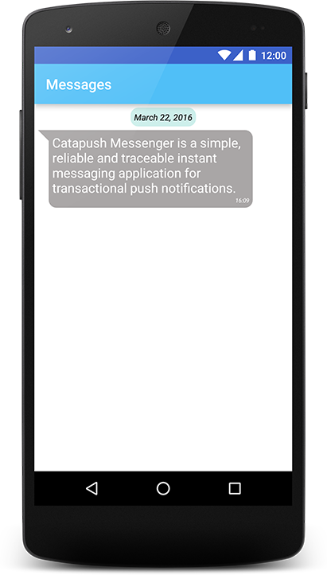
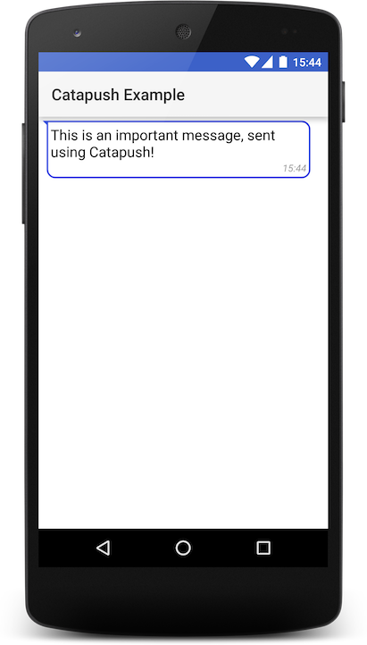
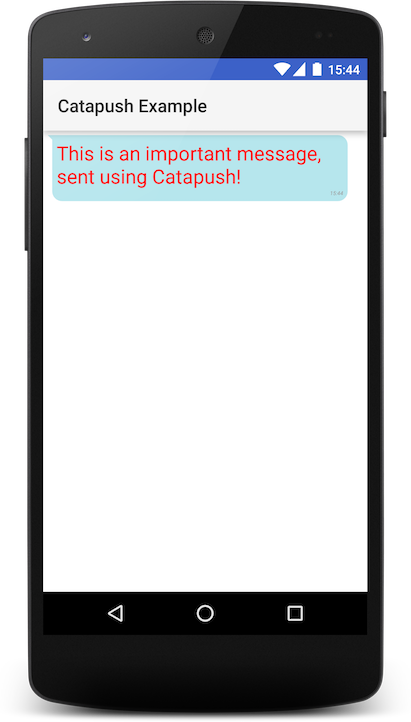
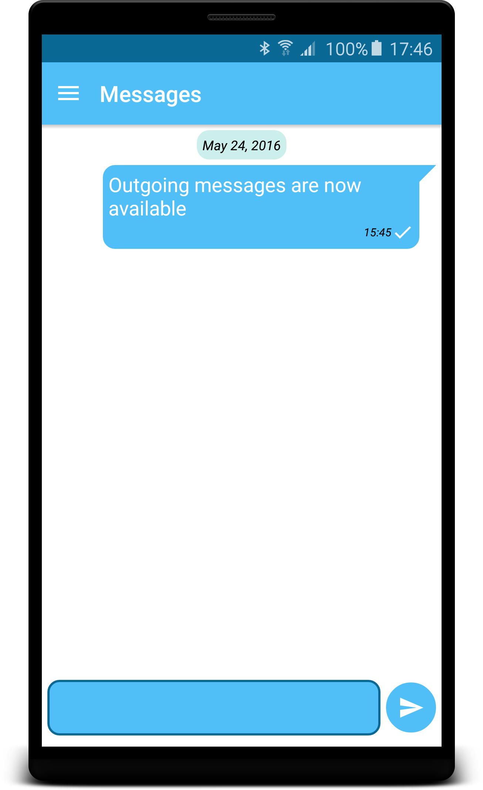

## Index

*   [Advanced UI](#advanced-ui)
*   [Catapush RecyclerView Adapter](#catapush-recyclerview-adapter)
    *   [Messages containing urls](#messages-containing-urls)
*   [Customization](#customization)
    *   [Colors](#colors)
    *   [Text](#text)
    *   [Corners](#corners)
    *   [Notification icon](#notification-icon)
*   [Sending messages](#sending-messages)

## [Advanced UI](#advanced-ui)

Catapush SDK comes with a native ready-to-go solution to display your messages.

To use it, you have to include the UI module as a dependency.
In your `app/build.gradle`, in the dependencies block, add a new implementation:

```groovy
implementation('com.catapush.catapush-android-sdk:ui:14.0.0')
```

Then you have to initialize the `CatapushUi` as soon as the `Catapush` instance is initialized:
```java
Catapush.getInstance()
  .init(
      this,
      catapushEventDelegate,
      Collections.emptyList(),
      template,
      null,
      new Callback() {
          @Override
          public void success(Boolean response) {
            Log.d("MyApp", "Catapush has been successfully initialized");
            CatapushUi.INSTANCE.init();
          }

          @Override
          public void failure(@NonNull Throwable t) {
            Log.d("MyApp", "Catapush initialization error: " + t.getMessage());
          }
      }
  );
```


## [Catapush RecyclerView Adapter](#catapush-recyclerview-adapter)

Catapush SDK provides full support for `RecyclerView` via `CatapushRecyclerViewAdapter`. This adapter can receive a list of messages and display them in a stylish bubble cell:



```java
adapter = new CatapushRecyclerViewAdapter();
recyclerView.setAdapter(adapter);

Catapush.getInstance().getMessagesAsList(new Callback<List<CatapushMessage>>() {
  @Override
  public void success(List<CatapushMessage> catapushMessages) {
    adapter.set(catapushMessages);
  }
  @Override
  public void failure(Throwable throwable) {
    Log.e("MyApp", throwable.getMessage());
  }
});
```

#### Toast on copy to clipboard

Catapush gives you the opportunity to copy a message content to the clipboard using long click. Every time you copy a message, a Toast message appears. You can disable this toast message with:
```java
adapter.setClipboardToast(false);
```

### [Messages containing urls](#messages-containing-urls)

Catapush gives you the opportunity to send messages containing URLs, like these

*   www.google.com
*   http://www.google.com
*   google.com

A message containg an URL is clickable and default web browser will take care of opening the URL. You can disable this behavior with:
```java
adapter.setUrlInPlainMessagesClickable(false);
```

## [Customization](#customization)

### [Colors](#colors)

Catapush provides a default color scheme that you can override to achieve the user experience you want. To customize the color scheme, you will need to create these colors in your **res/values/colors.xml**:
```xml
<color name="catapush_message_list_item_bg">#b6e6ed</color>
<color name="catapush_message_border_color">#b6e6ed</color>

<color name="catapush_message_title_color">#ff0000</color>
<color name="catapush_message_subtitle_color">#999292</color>
<color name="catapush_message_datetime_color">#ff9d9d9d</color>
```

Changing these colors, you will change the previous image into this:



### [Text](#text)

Catapush provides a default text style that you can override to achieve the user experience you want. To customize the text, you will need to create these styles in your **res/values/styles.xml**
```xml
<style name="catapush_message_title" parent="android:Widget.TextView">
  <item name="android:singleLine">false</item>
  <item name="android:textColor">@color/catapush_message_title_color</item>
  <item name="android:textSize">@dimen/catapush_message_title_size</item>
  <item name="android:typeface">sans</item>
  <item name="android:textStyle">normal</item>
</style>

<style name="catapush_message_subtitle" parent="android:Widget.TextView">
  <item name="android:textColor">@color/catapush_message_subtitle_color</item>
  <item name="android:textSize">@dimen/catapush_message_list_item_subtitle_size</item>
  <item name="android:textStyle">bold</item>
  <item name="android:typeface">sans</item>
</style>

<style name="catapush_message_datetime" parent="android:Widget.TextView">
  <item name="android:textColor">@color/catapush_message_datetime_color</item>
  <item name="android:textSize">@dimen/catapush_message_list_item_datetime_size</item>
  <item name="android:textStyle">italic</item>
  <item name="android:typeface">sans</item>
</style>
```

These styles relay on **colors** and **dimensions**. You can override Catapush default dimensions adding these values to your **res/values/dimens.xml** file:
```xml
<dimen name="catapush_message_title_size">22sp</dimen>
<dimen name="catapush_message_list_item_padding">5dp</dimen>
<dimen name="catapush_message_list_item_subtitle_size">12sp</dimen>
<dimen name="catapush_message_list_item_datetime_size">6sp</dimen>
```

Changing these dimensions like this will produce this result:



### [Corners](#corners)

Catapush message bubbles come with rounded corners. You can change them overriding this property in your **res/values/dimens.xml** file:
```xml
<dimen name="catapush_message_corner_radius">10dp</dimen>
```

If you don't want rounded corners at all, simply set it to `0dp`.

### [Notification icon](#notification-icon)

By default, Catapush shows your notification icon with a grey background. During the setup time, this color can be customized:
```java
Notification notification = Notification.builder()
    .swipeToDismissEnabled(false)
    .title(view.getString(R.string.app_name))
    .vibrationEnabled(true)
    .vibrationPattern(new long[]{100, 200, 100, 300})
    .soundEnabled(true)
    .soundResourceUri(sound)
    .circleColor(circleColor)
    .ledEnabled(true)
    .ledColor(Color.BLUE)
    .ledOnMS(2000)
    .ledOffMS(1000)
    .build()
```

The previous snippet shows a typical configiration of Catapush notification. The highlighted line shows how to customize the icon background color. **circleColor** can be any ARBG int value, for example:
```java
int circleColor = ContextCompat.getColor(context, R.color.accent);
```

## [Sending messages](#sending-messages)

Catapush provides the possibility to let your users sent you messages. Just add a **SendFieldView** to your layout, like this:
```xml
<com.catapush.library.SendFieldView
    android:id="@+id/send_container"
    android:layout_width="match_parent"
    android:layout_height="60dp"/>
```



SendFieldView colors can be customized like this:
```XML
    <color name="catapush_sentfield_border_color">YOUR COLOR</color>
    <color name="catapush_sentfield_bg_color">YOUR COLOR</color>
```