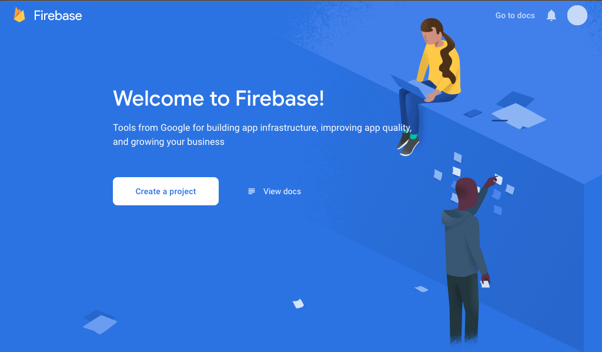
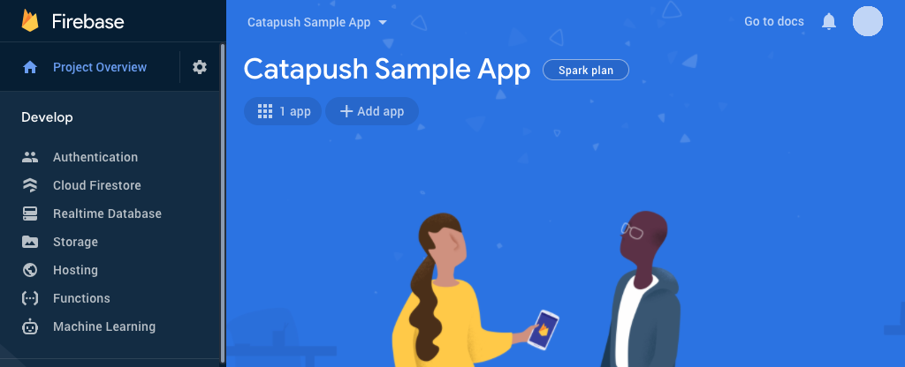
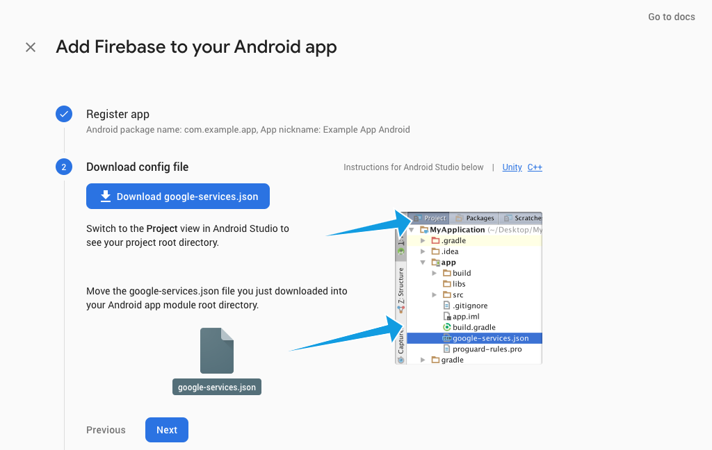
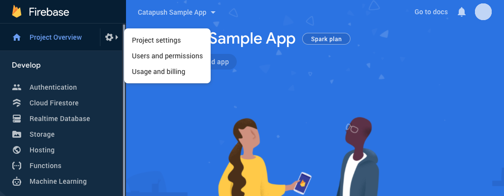
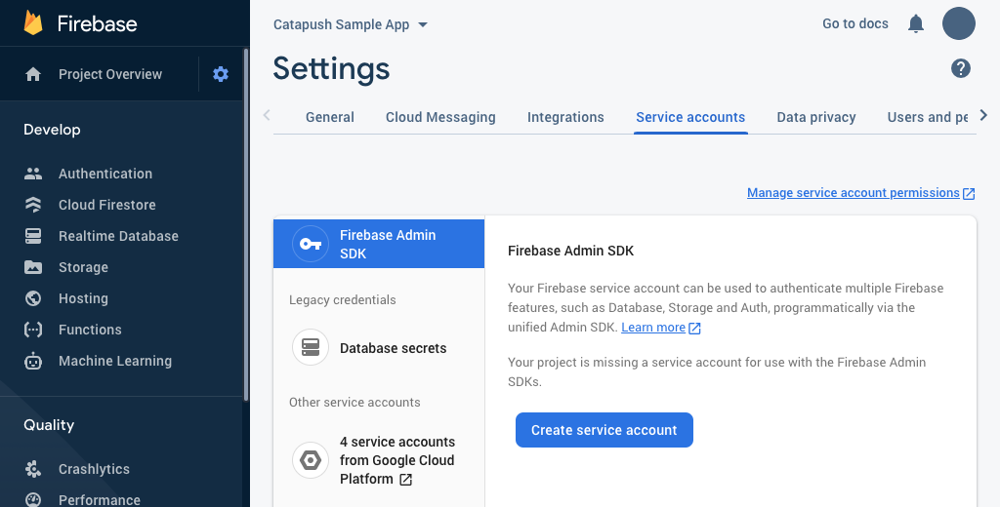
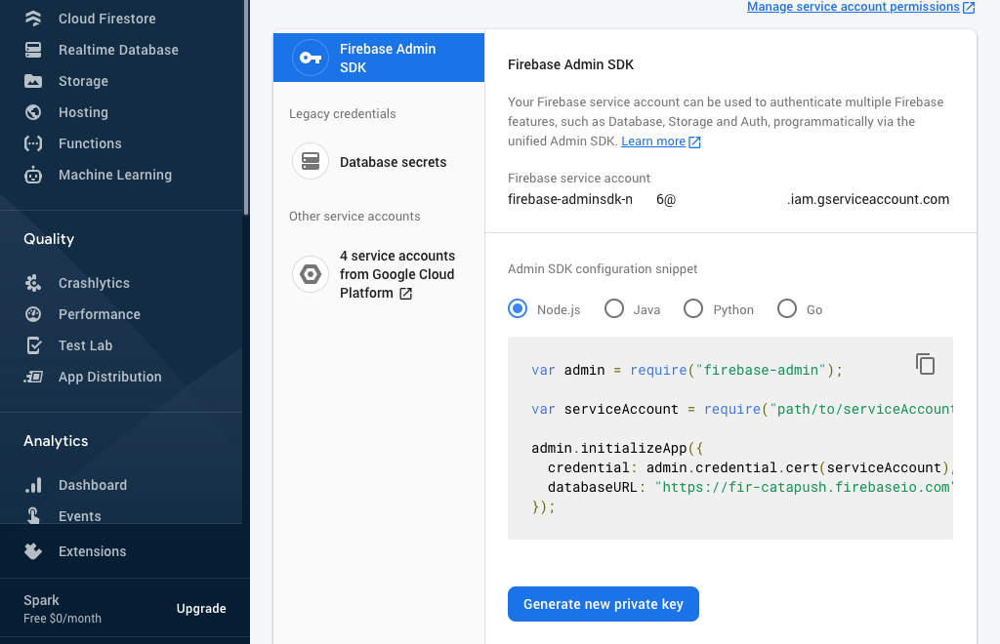

## Google Mobile Services (GMS) and Firebase Cloud Messaging (FCM) configuration

Catapush uses Firebase Cloud Messaging, the native push notification service available on GMS-enabled Android devices (Google Mobile Services), as a component of its reliable and secure message delivery system.

These instructions will guide you on how to setup your Firebase project and your Catapush dashboard to enable the background delivery on GMS-enabled Android devices.

 

**1** - Visit [console.firebase.google.com](https://console.firebase.google.com) and click "Create a project"/"Add project", then type a project name and choose a country/region

**2** - Select "Add app" then click on the Android logo.

**3** - Fill the form with the requested info: type your app package in "Android package name" and add an optional "App nickname". 
Finally, confirm with "Register app" button.

**4** - Now click on "Download google-services.json" button and press "Next". 
Add this file in your Android Studio project `/app` subfolder. 
Make sure you've configured the `classpath com.google.gms:google-services:{version}` in the plugin section of the `build.gradle` file of your project. 
Complete step 3 by clicking "Next" and step 4 by clicking "Skip this step" if you want to skip the app verification procedure.

**5** - Click on the gear icon then select "Project settings".

**6** - In the "Service accounts" tab click "Create service account".

**7** - Click "Generate new private key" then confirm clicking "Generate key". 
Securely store the JSON file containing the key.

**8** - Visit [www.catapush.com/panel/dashboard](https://www.catapush.com/panel/dashboard) and login with your Catapush credentials. 
Select your app from the side menu and select "Platforms". 
Enable "Use Service Account JSON", then select the file you downloaded at the previous step. Press "Save".

 

Firebase Cloud Messaging setup is now complete.

You can now proceed to the [Catapush Android SDK Documentation](DOCUMENTATION_ANDROID_SDK.md) to integrate the Catapush SDK for Android in your app.