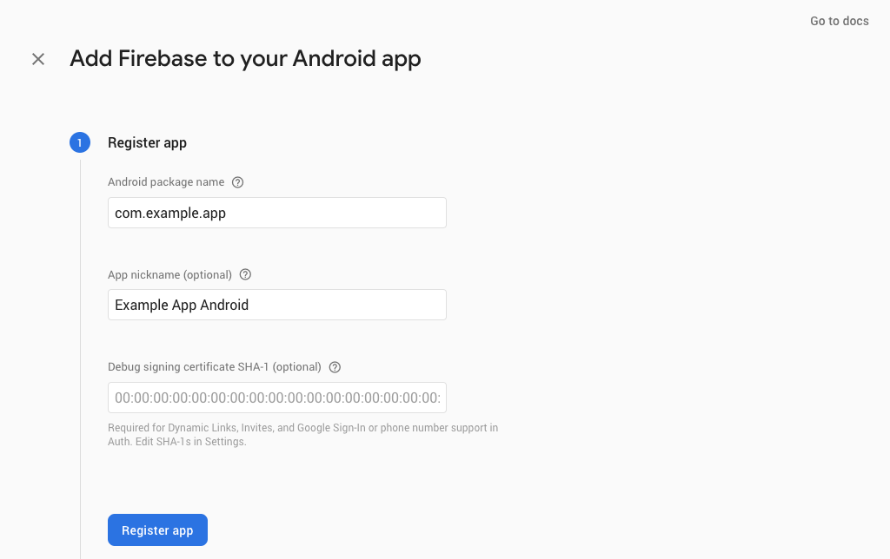
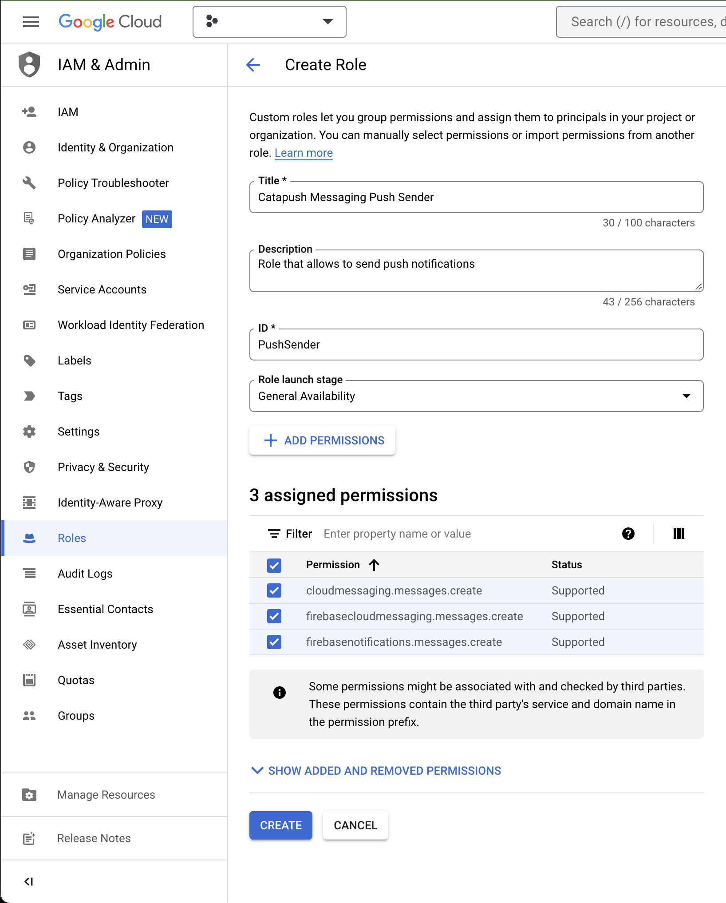
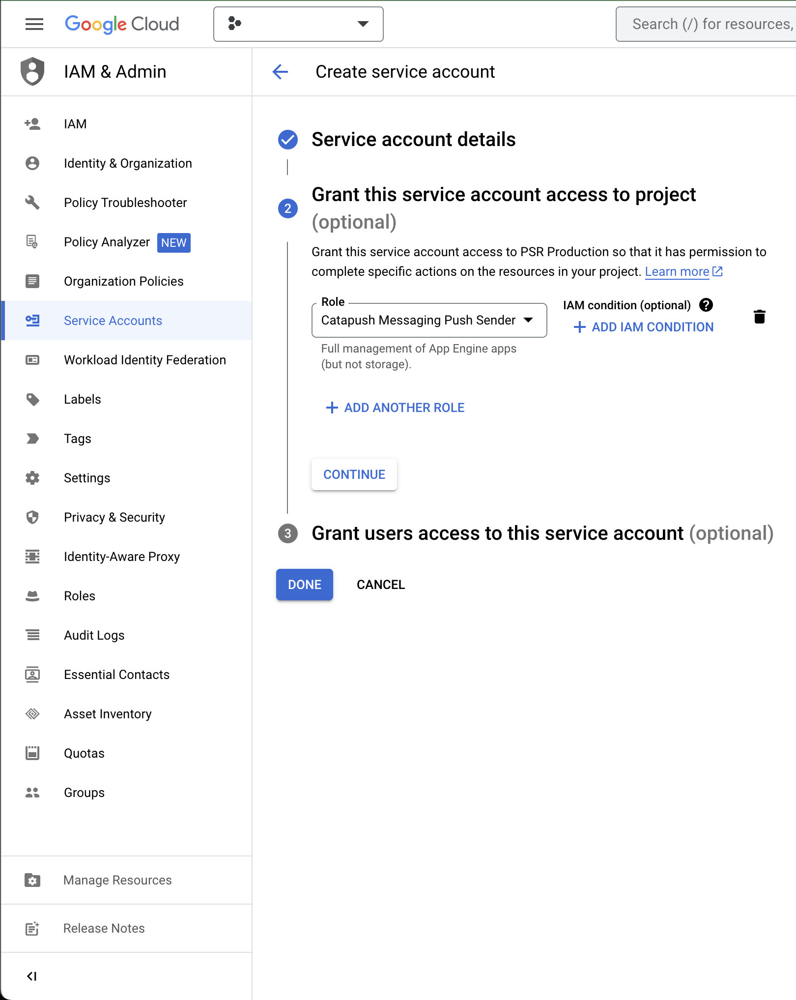
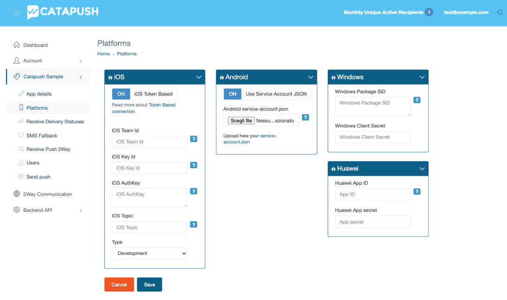

## Google Mobile Services (GMS) and Firebase Cloud Messaging (FCM) configuration

Catapush uses Firebase Cloud Messaging, the native push notification service available on GMS-enabled Android devices (Google Mobile Services), as a component of its reliable and secure message delivery system.

These instructions will guide you on how to setup your Firebase project and your Catapush dashboard to enable the background delivery on GMS-enabled Android devices.

 

**1** - If you haven't yet, create a new Firebase project for your app: visit the [Firebase Console](https://console.firebase.google.com) and follow the project creation assistant.

**2** - If if've never used any of the Firebase services in your app, configure the Firebase project and your app project following this integration guide: [Firebase Documentation - Android Setup](https://firebase.google.com/docs/android/setup)

**3** - Create a new authorization role in your Firebase project through this form: [Google Cloud Console - Create a new role](https://console.cloud.google.com/iam-admin/roles/create). Make sure that you've selected the correct project before continuing.

Fill in the form with the following values:

**4** - Create a new service account that will use the new role through this form: [Google Cloud Console - Create a new service account](https://console.cloud.google.com/iam-admin/serviceaccounts/create)

Fill in the form with the following values:

**5** - Once the service account is created, go to the "Keys" tab in its detail page and add a new key. 
Select the JSON format and download the private key file to you computer.

**6** - Visit the [Catapush Dashboard](https://www.catapush.com/panel/dashboard) and login with your Catapush credentials. 
Select your app from the side menu and select "Platforms". 
Enable "Use Service Account JSON", then select the file you downloaded at the previous step. Press "Save".

 

Firebase Cloud Messaging setup is now complete.

You can now proceed to the [Catapush Android SDK Documentation](DOCUMENTATION_ANDROID_SDK.md) to integrate the Catapush SDK for Android in your app.