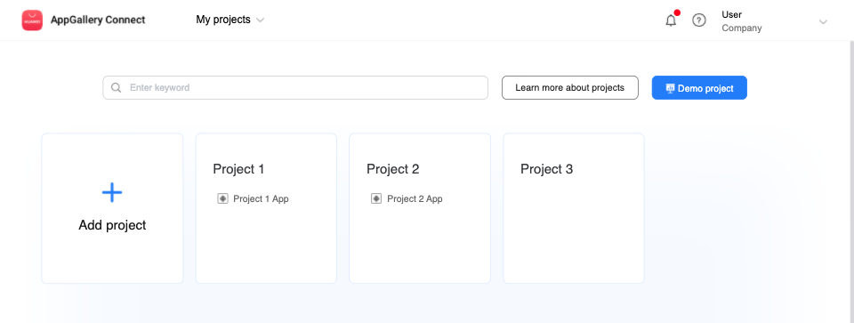
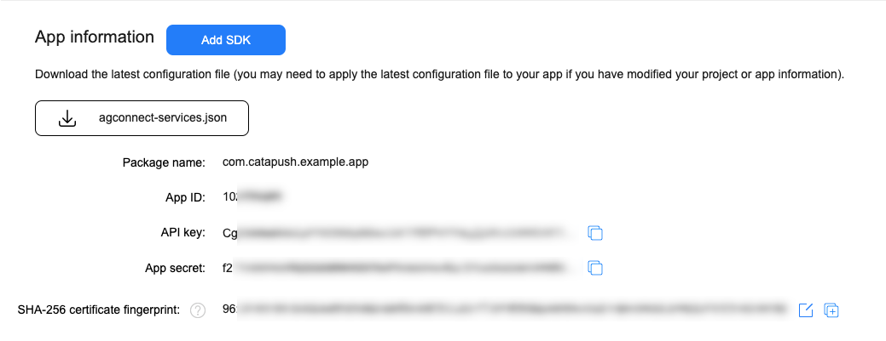

## Huawei Mobile Services (HMS) / Push Kit configuration

Catapush uses Push Kit, the native push notification service available on HMS-enabled Android devices (Huawei Mobile Services), as a component of its reliable and secure message delivery system.

These instructions will guide you on how to setup your AppGallery connect project and your Catapush dashboard to enable the background delivery on HMS-enabled Android devices.

<br/>

**1** - Visit [AppGallery Connect](https://developer.huawei.com/consumer/en/console), login  and select "My Projects" and click "Add project", then type a project name and click "OK".



**2** - Now go to "Project settings" and select the "General information tab" then press "Add app".


**3** - Fill the form with the requested info: type your app name, then type your app package name (must match the one you set in Android Studio for your release builds) and pick the app category and default language.<br/>
Finally, confirm with the "OK" button.


**4** - Now go back to "Project settings" and select the "Manage APIs tab", scroll down the list and enable "Push Kit".


**5** - Select the "General information" tab and scroll down to the `SHA-256 certificate fingerprint`: you have to enter the fingerprint of the certificate used to sign the APKs distributed to your users.

You can obtain the SHA-256 fingerprint using the JDK `keytool`:
```bash
keytool -list -v -keystore your_distribution_keystore.jks
```
You'll be prompterd for the keystore password, then it'll print out the keys fingerprints.

IMPORTANT: the HMS client libraries won't work unless this parameter is correctly set.



**6** - Now take note of the `App ID` and `App secret` values, we'll need it later, then click on "agconnect-services.json" button and add this file in your Android Studio project `/app` subfolder.
Make sure you've configured the `classpath com.huawei.agconnect:agcp:{version}` in the plugin section of the `build.gradle` file of your project and that you apply the AGCP plugin via `apply plugin: 'com.huawei.agconnect'` in the `build.gradle` file of your app.<br/>

**7** - Visit [www.catapush.com/panel/dashboard](https://www.catapush.com/panel/dashboard) and login with your Catapush credentials.<br/>
Select your app from the side menu and select "Platforms".<br/>


**8** - Paste the `App ID` and `App secret` values in the corresponding fields of the "Huawei" platform.


<br/>

HMS Push Kit setup is now complete.

You can now proceed to the [Catapush Android SDK Documentation](DOCUMENTATION_ANDROID_SDK.md) to integrate the Catapush SDK for Android in your app.