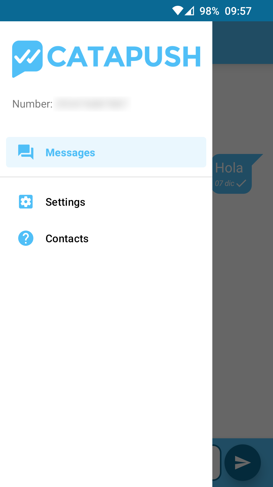
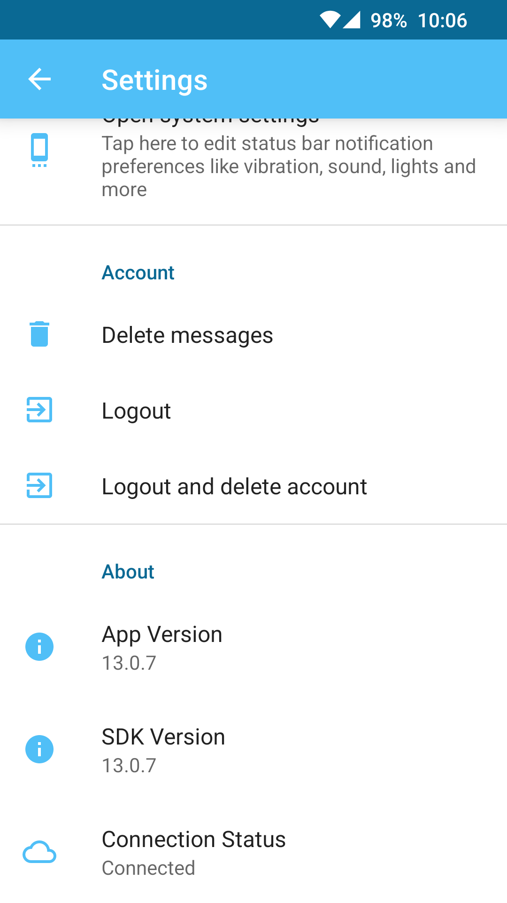

## Catapush Messenger Account Deletion

You can delete your Catapush Messenger account and all related data through the app.

### Android

Make sure you have updated your app to version 13.0.7 or later and that you've signed in with the account you'd like to delete. Then, follow these steps:

#### Step 1
Open the app drawer and tap "Settings"

#### Step 2
Select "Logout and delete account"

Confirm your choice and you'll be automatically logged out from the app once the account has been deleted from our servers.